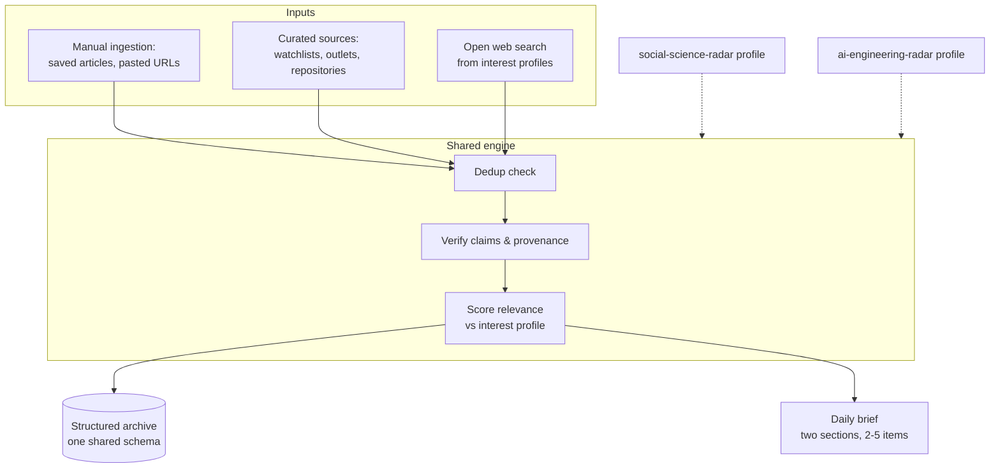

# ai_radar — Requirements

## Summary

A personal, public-sources-only knowledge radar: two user-facing agent skills (`social-science-radar`, `ai-engineering-radar`) built on one shared engine that scores, verifies, dedupes, and archives findings into a structured library — the long-term product — and composes a short combined daily brief. Built library-first: archive schema and manual ingestion come before web discovery; scheduling and automation are out of scope for v1.

---

## Problem Frame

The user already finds high-quality material on AI for social science and AI engineering — LinkedIn posts, Towards Data Science, researchers like Acemoglu and Sant'Anna — but has no structure for retaining it. Articles get saved and never read; serious reading only happens when a project forces it. Knowledge stays scattered, and each new project starts from an improvised search rather than an accumulated base.

The cost is compounding opportunity loss: no personal library to build projects on, nothing shareable with colleagues, and good ideas lost for lack of discipline. A daily automated report that merely lists links would recreate the same saved-but-never-read failure. The fix has to be a system that turns findings into a durable, growing, queryable library, with a reading-sized daily surface on top.

---

## Key Decisions

- **Library-first build order.** The accumulating structured archive is the core product; the daily brief is its reading surface, and scheduling is only a discipline harness. Build order: archive schema + manual ingestion, then web discovery + brief, then scheduling (deferred).
- **Two user-facing skills on one shared engine.** `social-science-radar` and `ai-engineering-radar` each get their own `SKILL.md` with description, selection criteria, and output instructions — the project should teach and demonstrate creating two distinct agent skills, and their outputs go to two different audiences. All machinery (archive schema, dedup, scoring rubric, brief template, supporting scripts) lives in one shared engine so the two skills cannot drift; domain differences live only in profile files.
- **One combined daily brief, two sections.** A single file with a social-science section and an AI-engineering section; cross-cutting items appear once, flagged as relevant to both.
- **Generic interest profile as the boundary mechanism.** Relevance is scored against a version-controlled, public-safe profile of interests written in generic terms. No client names, project internals, or confidential framing ever enter this repository.
- **Curated sources plus open discovery.** Each domain maintains a sources file (researcher watchlist, outlets, repositories) checked first on every run, supplemented by open web search derived from the interest profile.
- **Update-and-link deduplication.** Re-encountering an archived development is an enrichment event, not a duplicate: the existing entry is updated or linked to a follow-up, so the library compounds instead of just growing.
- **Strawman-first configuration.** The first interest profiles and sources files are drafted by the agent from this brainstorm's context; the user's editing pass is the quality gate. The radar never invents interests silently after that — profile changes are user-approved.

---

## Requirements

**Library and archive**

- R1. All findings are stored as structured entries in a single shared archive schema, regardless of which skill produced them, tagged by domain.
- R2. Every entry records source provenance: origin URL, publisher or author, publication date, and capture date.
- R3. Every entry classifies its source as primary source, academic research, or commentary.
- R4. Claims summarized in an entry must be traceable to the cited source; claims that cannot be verified are labeled as unverified.
- R5. Duplicates are handled by update-and-link: new information about an archived development updates or links to the existing entry.
- R6. Every entry is written public-safe and shareable as-is from day one.

**Ingestion and discovery**

- R7. Manual ingestion: the user can hand the system URLs or references — pasted singly or in batches, or as a list file dropped in an inbox location — and each flows through the same verify/score/dedup/archive path as discovered items. This is a v1 capability.
- R8. The user's backlog of saved articles is ingested through R7 as the library's seed corpus.
- R9. Web discovery: a radar run checks the domain's curated sources first, then runs open web searches derived from the interest profile.
- R10. Each domain has a configurable sources file holding a researcher watchlist, outlets, and repositories; the radar may propose additions, which the user approves.

**Relevance and scoring**

- R11. Relevance is scored against a configurable, version-controlled interest profile per domain.
- R12. Relevance lenses for policy and research products are expressed in public-safe, generic terms (e.g., "agentic simulation of policy interventions"), never via confidential project descriptions.
- R13. Every archived entry and every brief item carries an explicit selection rationale stating why it cleared (or would matter despite not clearing) the bar.
- R14. The bar is practical applicability: general AI news without an actionable implication for the user's research or engineering interests does not reach the brief.

**Daily brief**

- R15. A manually triggered run produces one brief file with two clearly separated sections: social science and AI engineering.
- R16. The brief contains at most 2–5 items per day across both sections, each with a why-it-matters line; items relevant to both domains appear once, flagged for both.
- R17. When nothing clears the relevance bar, the brief states that no material developments were found rather than padding with weak items.

**Skills and architecture**

- R18. Two user-facing skills exist — `social-science-radar` and `ai-engineering-radar` — each with its own `SKILL.md` containing description, selection criteria, and output instructions.
- R19. Both skills delegate to one shared engine for archive schema, dedup, verification, scoring, brief composition, and supporting scripts; domain differences live only in profile and sources files.
- R20. Each brief section is coherent enough to share standalone with its audience (economist/social-science colleagues; an applied AI product team).

**Boundary and project instructions**

- R21. The repository contains public information only: no confidential employer material, client names, or project internals, in any file including profiles and archive entries.
- R22. `CLAUDE.md` states the confidentiality boundary as a hard operating rule and covers: project purpose, the two-skills-one-engine architecture map, archive and brief file conventions, the verification and quiet-day rules, and how to run ingestion and radar runs.

---

## Key Flows

- F1. Manual ingestion
  - **Trigger:** User provides a URL or reference (single item or backlog batch).
  - **Steps:** Engine checks the archive for an existing entry; verifies the source and its claims; scores relevance against the domain profile; writes or updates a structured entry with provenance, source type, and rationale.
  - **Outcome:** Library entry exists; no brief is produced. **Covers R1–R8, R13.**
- F2. Radar run (per skill, manually triggered)
  - **Trigger:** User invokes `social-science-radar` or `ai-engineering-radar`.
  - **Steps:** Engine loads that domain's profile and sources file; checks curated sources, then open search; each candidate flows through the F1 verify/score/dedup/archive path; items clearing the bar are composed into that domain's section of today's brief.
  - **Outcome:** Archive grows; today's brief contains that domain's section (possibly "no material developments"). **Covers R9–R17.**

---

## Acceptance Examples

- AE1. **Covers R15, R17.** **Given** a radar run finds only routine AI news, **when** the brief is composed, **then** that section reads "no material developments found" and lists nothing.
- AE2. **Covers R5.** **Given** a paper already archived last month, **when** a new outlet reports its published results, **then** the existing entry is updated or linked with the new information and no second entry is created.
- AE3. **Covers R16.** **Given** an agentic framework for economic research relevant to both domains, **when** the brief is composed, **then** the item appears once, flagged as relevant to both sections.
- AE4. **Covers R4, R13.** **Given** a commentary piece asserting an unverifiable benchmark claim, **when** it is archived, **then** the claim is labeled unverified and the rationale notes the limitation.
- AE5. **Covers R21.** **Given** a candidate note that would explain relevance by referencing an internal employer project detail, **when** the entry is written, **then** the relevance is restated in generic interest-profile terms or the detail is omitted.

---

## Success Criteria

- The daily brief is readable in about five minutes, and the user actually reads it most days — the anti-goal is a new pile of unread reports.
- When starting a new project or research question, the archive yields a useful starting set of entries by domain tag and topic.
- Selection rationales are informative enough for the user to judge, within the first weeks, whether relevance scoring works and to tune the profiles.
- A colleague could be given any brief section or archive entry as-is with zero confidentiality review needed.

---

## Scope Boundaries

**Deferred for later**

- Scheduling and automation (the daily 2:00 pm run) — the harness comes after selection quality is proven manually.
- Weekly or monthly synthesis reports that consolidate themes across daily runs.
- A sharing or publishing mechanism for colleagues — entries are written public-safe from day one so this costs nothing later.
- Additional domains beyond the two radars — enabled by the profile design but not built.

**Outside this product's identity**

- A general AI news aggregator — items without practical applicability to the user's interests are noise by definition.
- LinkedIn scraping or paywall circumvention — researchers are followed via their public trails (arXiv, NBER, SSRN, university pages, blogs).
- Any employer work tooling — this repository never holds or references confidential material, whatever the convenience.

---

## Dependencies / Assumptions

- The repository is not yet a git repository; version control is assumed to be initialized at implementation.
- Radar runs depend on web search and fetch tooling available in the Claude Code runtime.
- LinkedIn, today's best manual source, is not automatable; its value is recovered through manual ingestion (R7) and upstream public trails.
- The user is available to trigger runs manually in v1; consistency depends on that discipline until scheduling lands.

---

## Outstanding Questions

**Deferred to planning**

- Archive entry granularity (one entry per source item vs one per development with linked sources) and the concrete file format and layout.
- Dedup index mechanism and the scoring scale's concrete shape.
- Brief file naming, location, and how consecutive days accumulate.
