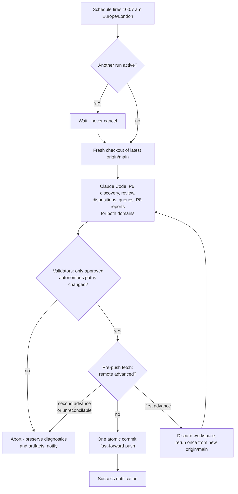
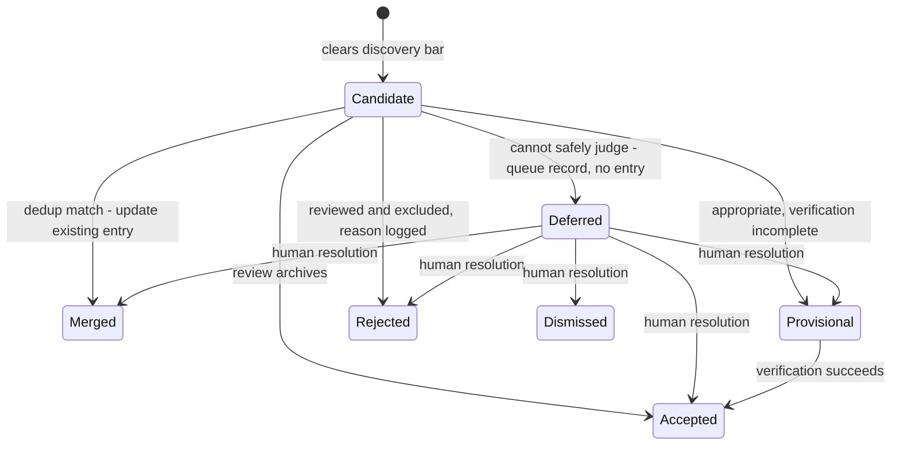

# feat: Unattended daily radar — scheduled runs with deterministic guardrails

## Summary

Turn the manually validated radar into an unattended daily run at 10:07 am Europe/London: a GitHub Actions harness invokes the official Claude Code action (OAuth token, never an API key) to run both skills' bounded discovery through the existing engine, while repository-owned deterministic validators enforce the autonomous-path allowlist and git delivery. Candidates the run cannot safely judge defer into new metadata-only review queues instead of blocking, and source proposals move out of `profiles/` into a queue of their own. Every run ends with a notification; a Claude Code cloud Routine using the same validators is the documented fallback if the OAuth route proves unviable.

---

## Problem Frame

v1 deliberately deferred scheduling until selection quality was proven manually; U8 closed that gate on 2026-07-22. What remains is the discipline dependency the v1 plan named as a known risk: the library grows only when the user remembers to trigger runs. The enduring value of the system is the accumulating, traceable library — so days without runs are days of silent loss, and the cost lands on the product's core rather than its reading surface.

The manual pipeline assumed a present user at two points: the boundary self-check's "stop and ask the user" (engine P7) and the review disposition itself. Unattended operation must replace both with behavior that is safe without a human — while the guarantees the user cares most about (repository integrity, the information boundary, review-gated admission) must now hold even when the model misbehaves, which instructions alone cannot ensure.

---

## Key Decisions

- **Library-first automation.** The run's purpose is safe, cumulative library growth without daily involvement; reports remain a filtered view. A run that writes reports without their supporting library entries has failed, whatever else it did.
- **Hybrid enforcement: deterministic harness around an agent brain.** Claude Code performs all model-dependent work through the existing skills, profiles, and engine; deterministic validators live in the repository and are usable by manual sessions; the scheduled harness invokes them structurally before any commit or push. Integrity guarantees are enforced by scripts, not promised by instructions. This knowingly ends the script-free era — v2 sanctions it.
- **OAuth-only authentication, treated as a feasibility gate.** No Anthropic API key is created or stored, and no custom application calls an LLM API. The preferred route is the official Claude Code GitHub Action with `CLAUDE_CODE_OAUTH_TOKEN`, contingent on verification (R31). If unviable, the fallback is a Claude Code cloud Routine plus the repository validators — with its weaker, agent-invoked enforcement boundary explicitly documented. Never a silent API-key downgrade.
- **Defer-don't-guess unattended review.** The unattended equivalent of P7's "stop and ask the user" is "defer this candidate and continue safely." One difficult candidate never blocks the run, and a boundary doubt is never resolved in favour of inclusion.
- **`deferred` is a queue state, not an entry status.** Entry statuses remain `accepted | provisional`. A deferred candidate produces no library entry at all — deferral means appropriateness itself is unresolved, whereas provisional assumes inclusion is appropriate and only verification is incomplete.
- **`profiles/` stays fully human-controlled; `reviews/` is the autonomous queue namespace.** No carve-out lets automation edit part of `sources.md`. Source proposals and deferred candidates live in dedicated review-queue files that are approved autonomous-write paths and are not part of the knowledge library.
- **`origin/main` is the sole coordination point.** Same-day manual and scheduled work is supported explicitly through clean-base, fast-forward-only, optimistic concurrency: a rejected writer reruns once from the new remote state rather than merging. Avoiding overlap may be a personal habit, never a correctness requirement.
- **Bounded discovery only.** The daily run covers both domains' web discovery and reports. Inbox and backlog material is processed by a separate triggered workflow, not the daily run.
- **GitHub-native observability for v2.** Notifications flow through GitHub's notification inbox and email plus an Actions job summary — no Slack, Teams, or other external integration. During the pilot, every completed run notifies (success or failure) so silent failures are impossible while reliability is unproven; whether success notifications continue is a scheduled follow-up decision, not an open question.

---

## Actors

- A1. The user — reads reports and notifications, reviews the queues, promotes sources, resolves deferred candidates, approves all changes to profiles, engine, skills, and workflow behaviour.
- A2. The scheduled unattended run — Claude Code executing both skills inside the harness with no human available.
- A3. Interactive manual sessions — Claude Code with the user present; ingestion, manual scans, and queue resolution happen here under the same git discipline.
- A4. The deterministic layer — the scheduling harness plus repository-owned validators; schedules, validates, coordinates git, preserves failure artifacts, and notifies.

---

## Requirements

**Scheduled run scope and priorities**

- R1. An unattended run executes daily at 10:07 am Europe/London, covering both domains in one run. The schedule is fixed to UK local time across GMT and British Summer Time — it tracks the user's working day rather than drifting an hour at DST transitions — and 10:07 avoids the congested top-of-hour cron slot. This is the intended local run time; cron scheduling is best-effort, and an occasionally late platform start is acceptable. The implementation ultimately corresponds to:

  ```yaml
  on:
    schedule:
      - cron: "7 10 * * *"
        timezone: "Europe/London"
  ```
- R2. Run scope is bounded web discovery and review (engine P6 → review → dispositions) plus report composition (P8) for each domain; inbox and backlog processing is excluded.
- R3. Within a run, priority order is: preserve existing library integrity; archive new accepted entries; update and cross-link existing entries where warranted; keep `library/INDEX.md` and related artifacts consistent; generate the two daily reports; commit and push the validated run.
- R4. Degradation is candidate-level: an ambiguous, inaccessible, insufficiently verified, or boundary-doubtful candidate is deferred or quarantined with its reason recorded, excluded from reports, and the run continues with remaining candidates.
- R5. A run that grows and validates the library but produces quiet-day reports is successful; a run that completes both scans, finds nothing qualifying, and writes valid quiet-day reports is successful.
- R6. A run that produces reports without their supporting library entries is a failure; every report item must originate from an accepted, verified library entry.
- R7. A run whose artifacts exist only locally or in an ephemeral runner is operationally incomplete — remote persistence is a condition of run completion.

**Unattended review semantics**

- R8. The unattended equivalent of P7's "stop and ask the user" is: defer the candidate with a recorded reason and continue safely.
- R9. A boundary doubt always produces `deferred`, never `provisional` and never a library entry; boundary uncertainty is never resolved autonomously in favour of inclusion.
- R10. The candidate lifecycle distinguishes: `accepted` (verified, admitted), `provisional` (clearly appropriate for the library, verification incomplete), `deferred` (safe admissibility unresolved, no entry created), `rejected` (reviewed and intentionally excluded).
- R11. Engine documentation is revised to encode R8–R10: the unattended P7 variant, the provisional-vs-deferred distinction in the lifecycle documentation, and the P6.5 source-proposal revision (R18). These revisions are themselves human-reviewed changes.

**Deferred-candidates queue**

- R12. Deferred candidates are recorded in `reviews/deferred_candidates/social_science.md` and `reviews/deferred_candidates/ai_engineering.md` — approved autonomous-write paths that are review queues, not part of the library.
- R13. Each record is metadata-only: candidate title (only when publicly visible); canonical public URL with tracking parameters, credentials, and tokens removed; domain; date first encountered; date most recently encountered; source type when determinable; reason class; concise deferral reason; the discovery query or active source that surfaced it; action needed from the reviewer; status; and, once reviewed, resolution date, outcome, and linked entry or rejection-log reference. Candidate content is never copied into the queue.
- R14. Reason classes are controlled: `information_boundary_unclear`, `access_or_license_unclear`, `source_identity_unclear`, `verification_insufficient`, `relevance_requires_judgment`, `possible_duplicate_requires_review`, `other`. Statuses are `pending`, `archived`, `provisional`, `rejected`, `dismissed`, `duplicate`.
- R15. Before creating a record, the run deduplicates against the library, the rejection log, and the existing queue; a re-encountered pending candidate gets only its most-recently-encountered date updated plus materially new review context — never a duplicate record.
- R16. The run never resolves, archives, rejects, or dismisses a deferred candidate. Human-reviewed resolution may create an accepted entry, create a provisional entry, merge with an existing entry, add to the rejection log, or dismiss — and is recorded in the queue before destination artifacts change, preserving the audit trail.
- R17. Deferred candidates are excluded from reports and report footers; the run summary exposes only counts and reason classes, never sensitive detail. A deferral never blocks or fails the rest of the run.

**Source-proposal queue**

- R18. Autonomous source proposals move to `reviews/source_proposals/social_science.md` and `reviews/source_proposals/ai_engineering.md` (approved autonomous-write paths); the active watchlists remain in `profiles/<domain>/sources.md`, and engine P6.5 is revised to point at the queue instead of a section inside `sources.md`.
- R19. Each proposal records: source name, domain, URL, date first discovered, date most recently encountered, why it appears useful, which discovery or entry surfaced it, source type, proposed search purpose, status (`pending`, `promoted`, `rejected`, `already_covered`), and any review note.
- R20. Before proposing, the run checks whether the source is already active, already proposed, rejected, or clearly covered; a re-encountered pending proposal gets only its last-encountered date updated plus materially new justification.
- R21. The run never queries pending proposals in scans and never promotes, rejects, or modifies the active source list; only the user, or an interactive session with the user's explicit approval, promotes a proposal. A proposal never blocks or fails the run, and appears in the run summary only — never as a substantive report item unless the underlying development independently qualifies.

**Autonomous write boundary**

- R22. Approved autonomous-write paths are exactly: `library/entries/`, `library/INDEX.md`, `library/rejections.md`, `reports/<domain>/daily/`, `reviews/source_proposals/`, `reviews/deferred_candidates/`.
- R23. `profiles/`, `engine/`, `CLAUDE.md`, `.claude/skills/`, and all workflow and validator configuration remain human-controlled; validation rejects any automated change outside the R22 allowlist before commit.

**Git delivery and concurrency**

- R24. Every radar run — manual or scheduled — starts clean-base: check the working tree, fetch `origin/main`, start only from the latest `origin/main`, and synchronise fast-forward-only. No run overwrites, stashes, discards, or commits unrelated human work automatically.
- R25. The scheduled run begins from a fresh checkout of the latest `origin/main`, validates changed paths against R22 before committing, fetches `origin/main` again immediately before pushing, and — if the remote has not advanced — creates one atomic commit for the whole run and pushes it.
- R26. If the remote advanced before the push, the run discards its workspace, checks out the new `origin/main`, reruns the full workflow once from that state (regenerating library updates, index, and same-day reports from the current repository as source of truth), and attempts the atomic push again.
- R27. If the remote advances again, or the rerun cannot reconcile cleanly, the run aborts the push, marks itself incomplete, preserves diagnostics and generated artifacts through the automation platform where possible, and notifies the user. Never a force-push, partial commit, or autonomous merge, rebase, or conflict resolution.
- R28. Concurrency control prevents two cloud runs for the repository executing simultaneously; a later run may wait for the active one but never cancels a run that has begun writing artifacts.
- R29. Local manual runs refuse to start with a dirty working tree (the user resolves it), stop and explain when the local branch cannot fast-forward to `origin/main`, and — once synchronised — treat any existing same-day report as the base for the engine's union and rerun rules.

**Enforcement architecture and authentication**

- R30. Claude Code performs all model-dependent work — discovery, review, relevance scoring, archiving, report writing — using the existing skills, profiles, and engine; deterministic repository validators are invocable by both scheduled and manual workflows; the scheduled harness must invoke them structurally before it may commit or push; the harness (GitHub Actions) provides scheduling, concurrency, retry control, failure-artifact preservation, and delivery enforcement. No custom application or script calls an LLM API directly.
- R31. Authentication is a feasibility gate. Before implementation, verify: that `CLAUDE_CODE_OAUTH_TOKEN` is supported for scheduled automation with the official Claude Code GitHub Action; how it is generated, stored, rotated, and revoked; compatibility with the relevant Claude subscription and employer policy; any separate usage or billing implications; and the failure behaviour when the token expires or is revoked.
- R32. Authentication boundary (binding): Claude Code performs all model-dependent work using subscription OAuth authentication through `CLAUDE_CODE_OAUTH_TOKEN`; no `ANTHROPIC_API_KEY`, Anthropic Console API billing integration, custom LLM API client, or alternative model provider (Bedrock/Vertex/Foundry) is created, stored, referenced, or used, absent an explicit redesign, and there is no fallback to API-key authentication. The token lives only in GitHub Actions secrets and is never committed or printed. Deterministic checks enforce this: the workflow contains no `anthropic_api_key` input; `ANTHROPIC_API_KEY` is absent from the workflow environment and the run fails closed if unexpectedly present; the Action receives only `${{ secrets.CLAUDE_CODE_OAUTH_TOKEN }}` for Anthropic authentication; logs and summaries reveal at most a boolean secret-readiness result and never any portion of the token.
- R33. If the OAuth route is unavailable, unsuitable, or not approved, the fallback is a Claude Code cloud Routine using the repository validators — documented as providing weaker structural enforcement, because validator invocation remains agent-controlled.

**Observability and governance**

- R34. During the initial pilot period, every completed scheduled run — success or failure — produces a notification, delivered through GitHub's native notification inbox and email settings; no Slack, Teams, or other external notification integration is added in v2.
- R35. Private repository visibility is a hard governance requirement, verified through the appropriate GitHub command or interface during implementation and acceptance testing — never asserted from local repository evidence alone.
- R36. The information-boundary policy in `CLAUDE.md` applies unchanged to unattended runs; the cloud runner has no access to the user's machine or employer-internal systems, and all run outputs (entries, reports, queue records, summaries) remain public-safe.
- R37. Every workflow run produces a concise GitHub Actions job summary containing: overall status; whether the run completed or was operationally incomplete; new accepted-entry count; updated/merged-entry count; provisional-entry count; deferred-candidate count by reason class; rejected or failed-candidate count; source-proposal count; item count in each daily report; the final commit hash when pushed successfully; links or paths to both dated reports; and links to preserved diagnostics or artifacts when the run fails. The summary contains no credentials, restricted candidate content, or sensitive boundary-review detail.
- R38. After an initial reliability period of approximately two to four weeks, a follow-up decision determines whether successful-run notifications continue or notifications become failure-only.

---

## Key Flows

- F1. Scheduled daily run — happy path
  - **Trigger:** Schedule fires at 10:07 am Europe/London; no other run active.
  - **Steps:** Fresh checkout of latest `origin/main` → both domains: P6 discovery, review, dispositions; deferrals and proposals appended to queues → P8 reports → validators confirm only R22 paths changed → pre-push fetch shows no remote advance → one atomic commit, fast-forward push → success notification.
  - **Outcome:** Library grown, reports written, remote persisted. **Covers R1–R7, R22–R25, R34.**
- F2. Push race
  - **Trigger:** Pre-push fetch shows `origin/main` advanced (e.g., the user pushed a manual ingestion mid-run).
  - **Steps:** Discard workspace → checkout new `origin/main` → rerun the full workflow once → retry atomic push. A second advance, or an unreconcilable rerun: abort, mark incomplete, preserve diagnostics and artifacts, notify.
  - **Outcome:** Either a clean push from the latest state, or a preserved, diagnosed, notified incomplete run — never a merge, force-push, or partial commit. **Covers R26, R27.**
- F3. Candidate deferral
  - **Trigger:** Unattended review meets a candidate it cannot safely judge (boundary doubt, access unclear, verification insufficient, relevance requires judgment).
  - **Steps:** Deduplicate against library, rejection log, and queue → append one metadata-only pending record (or update last-encountered on a known one) → exclude from reports → continue with remaining candidates → count by reason class in the run summary.
  - **Outcome:** No entry created, no run failure, a reviewable queue record. **Covers R4, R8–R10, R12–R15, R17.**
- F4. Human resolution of a deferred candidate
  - **Trigger:** The user (or an interactive session with explicit approval) reviews a pending queue record.
  - **Steps:** Decide the outcome (accepted entry, provisional entry, merge, rejection-log line, dismissal) → record resolution date and outcome in the queue → then write the destination artifacts.
  - **Outcome:** Queue and library stay mutually consistent with a clear audit trail. **Covers R16.**
- F5. Same-day manual run after the cloud run
  - **Trigger:** The user starts a manual scan or ingestion after the scheduled run.
  - **Steps:** Refuse if the working tree is dirty → fetch and fast-forward onto the cloud commit → run normally, treating today's existing report as the base for the union rerun rule → push; if the push races, rerun once from the new remote state.
  - **Outcome:** Manual and scheduled work interleave with `origin/main` as the coordination point. **Covers R24, R26, R29.**



---

## Candidate Lifecycle

The unattended run adds `deferred` as a queue-level state; entry statuses are unchanged.



---

## Acceptance Examples

- AE1. **Covers R8, R9, R13, R17.** Given discovery surfaces a document whose provenance suggests it may be non-public material, when the unattended run reviews it, then no entry is created, one metadata-only `pending` record with reason class `information_boundary_unclear` is appended to the deferred queue, the item appears in neither report nor footer, and the run continues and completes.
- AE2. **Covers R5, R25, R34.** Given both scans complete and nothing clears the report bar or library bar, when the run finishes, then both quiet-day reports are written, one atomic commit is pushed, and the success notification states the scans ran and found no material developments.
- AE3. **Covers R26, R27.** Given the user pushes a manual ingestion while the 10:00 am run is mid-flight, when the run's pre-push fetch detects the advance, then it discards its workspace, reruns once from the new `origin/main`, and pushes; if the remote advances again, it aborts with preserved artifacts and a failure notification — no merge, no force-push.
- AE4. **Covers R18, R20–R23.** Given discovery encounters a genuinely new outlet worth watching, when the run completes, then a `pending` proposal exists in the relevant `reviews/source_proposals/` file, `profiles/<domain>/sources.md` is byte-identical to before the run, path validation passes, and the proposal is mentioned only in the run summary.
- AE5. **Covers R6.** Given a report draft cites a development for which no accepted library entry exists, when the run validates itself, then the run is treated as failed rather than pushing the report.
- AE6. **Covers R24, R29.** Given the user starts a manual radar run with uncommitted local changes, when the run begins its clean-base check, then it stops and asks the user to commit, stash, or discard — it never proceeds and never touches the changes itself.

---

## Scope Boundaries

### Deferred for later

- Scheduled or triggered inbox/backlog processing (LinkedIn saves, manually supplied material, older backlog) — a separate workflow designed after the daily run is proven.
- Weekly/monthly synthesis, a combined cross-domain overview report, additional domains, and any sharing/publishing mechanism (all carried from v1's deferral list).
- Tuning of discovery quality or profile thresholds based on accumulated unattended-run rationale data.

### Outside this product's identity

- Any Anthropic API key, and any custom application or script calling an LLM API directly.
- Autonomous edits to `profiles/`, `engine/`, `CLAUDE.md`, skills, or workflow configuration — including "just one section" carve-outs.
- Autonomous promotion of source proposals or resolution of deferred candidates.
- Force-pushes, autonomous merges/rebases/conflict resolution, or any automated handling of human work in progress.
- General AI news aggregation, LinkedIn scraping, paywall circumvention (carried from v1).

---

## Dependencies / Assumptions

- The official Claude Code GitHub Action's support for `CLAUDE_CODE_OAUTH_TOKEN` in scheduled (non-interactive, cron-triggered) automation is an unverified assumption — R31 gates implementation on confirming it, alongside account eligibility and employer approval.
- Web search and fetch must be available to Claude Code inside the Action runtime; degraded search degrades discovery but must never corrupt the library (review gates and validators hold regardless).
- The repository's skills (`.claude/skills/`), engine, and profiles are assumed to load normally in the headless runtime, since they travel with the checkout.
- Usage/billing implications of scheduled runs against the user's Claude subscription are unknown until R31 verification.
- Employer organisational approval covers running this workflow in GitHub-hosted runners with an OAuth secret.

---

## Outstanding Questions

### Deferred to planning

- Validator implementation shape, workflow file structure, and the concrete concurrency mechanism.
- Exact record layout and formatting conventions for the two review-queue file types.
- Job-summary rendering details and whether diagnostics also land as platform artifacts on success.
- How the fallback Routine variant would be triggered and monitored, if R31 forces that path.

---

## Sources / Research

- engine/ENGINE.md — P6 lookback and discovery order (line 69), P7 "stop and ask the user" (line 77), P8 report rules and same-day union (lines 81–86); all verified in-session.
- engine/schema.md — entry statuses `accepted | provisional` (line 15) and the four dispositions (line 74); no `deferred` state exists anywhere in engine, skills, or CLAUDE.md (verified by search).
- profiles/social_science/sources.md:39 and profiles/ai_engineering/sources.md:33 — the current "Proposed (pending approval)" sections R18 relocates; both SKILL.md files cite the convention as "engine P6.5".
- Verified absent: no `scripts/`, `.github/workflows/`, Makefile, shell scripts, or cron/launchd references — this work establishes the repo's automation patterns from scratch.
- docs/brainstorms/2026-07-22-ai-radar-requirements.md and docs/plans/2026-07-22-001-feat-ai-radar-v1-plan.md — scheduling explicitly deferred until selection quality proven manually; U8 acceptance (2026-07-22) satisfied that gate.
- CLAUDE.md — the five-question boundary self-check, repository-governance rules, and workflow checkpoint discipline this design preserves.
