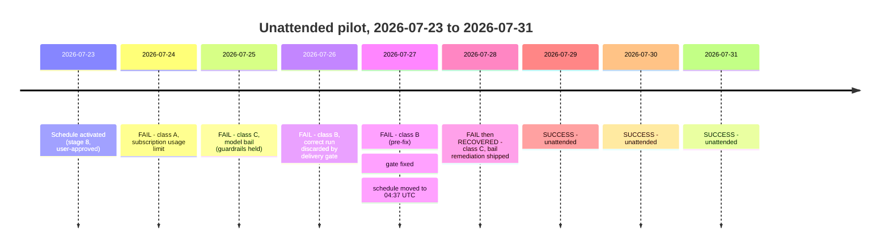

# 2026-07-31 — Pilot learnings and one-week extension

Consolidated learning record for the unattended radar pilot, covering activation (2026-07-23) through the fourth consecutive successful run (2026-07-31). Companion to the two incident documents, which stand unmodified as the primary evidence:

- `docs/ops/2026-07-27-scheduled-delivery-incident.md` — classes A and B
- `docs/ops/2026-07-28-model-bail-review.md` — class C

Decision recorded here: **the pilot is extended by one week, to approximately 2026-08-07.**

---

## 1. Pilot timeline

Five failures, then four consecutive successes. Every failure had a distinct root cause; none recurred after its fix.

## 2. Output produced

| Date | New entries | Entries updated | Reports |
|---|---|---|---|
| 2026-07-28 | 11 | — | 2 |
| 2026-07-29 | 11 | 1 | 2 |
| 2026-07-30 | 8 | — | 2 |
| 2026-07-31 | 5 | 1 | 2 |
| **Total** | **35** | **2** | **8** |

Library at 76 entries at the close of the 2026-07-31 run. One of the eight reports was an honest empty report (social science, 2026-07-31) — see learning 8.

*(The table counts unattended-run output only. Later the same day, the first human review pass added four further entries through manual ingestion and retired three unverifiable LinkedIn stubs — see section 6. Those are review-pass output, not run output, and are deliberately excluded here.)*

---

## 3. What the pilot proved

### 3.1 The guardrails held under every single failure

This is the most important finding of the pilot, and the one to lead with in any governance conversation. Across five distinct failure modes — an authentication failure, two model bails, and two discarded-delivery bugs — **the library was never corrupted, no partial state was committed, and no bad report was published.** In the class C bails the validators aborted on missing scan evidence exactly as designed; in the class B failures a fully correct run was thrown away rather than half-delivered.

The system's failure mode is *producing nothing*, never *producing something wrong*. For an unattended process writing into a knowledge base, that is the correct asymmetry, and it was verified live rather than assumed.

### 3.2 Deterministic validators are worth their cost

Every containment above came from Python validators, not from the model behaving well. The design split — model does judgment, deterministic code enforces integrity — is the reason five failures produced zero cleanup work.

---

## 4. What broke, and what it taught

### Learning 1 — certify on the trigger you will actually use

**What happened (class B):** the delivery gate was written as `inputs.mode == 'full'`. The `inputs` context is only populated on `workflow_dispatch`; on `schedule` triggers it is the empty string. Every scheduled run therefore skipped delivery. All rollout drills (stages 3–7) had used `workflow_dispatch` with an explicit mode, so the bug was invisible through the entire certification programme.

**The lesson, generalised:** a certification path that differs from the production path certifies the wrong thing. Two full correct scans — 134 and 133 turns of real work — were computed and discarded before this surfaced. Any future automation should be exercised at least once on its real trigger before being declared ready.

### Learning 2 — GitHub cron is UTC-only, and silently so

The `timezone` key is not supported in GitHub Actions schedules; a schedule declared in local time simply runs in UTC. The run has been moved to `37 4 * * *` UTC, which is 05:37 London in summer and 04:37 in winter — deliberately chosen to land before the working day at both ends of the year rather than drifting across it. The off-hour minute avoids the scheduler congestion that clusters on `:00`.

### Learning 3 — prompts need a completion contract, not just a task list

**What happened (class C):** twice, the model terminated cleanly after ~30–43 turns having read its instructions and then stopped — zero fetch attempts, no writes, no evidence file. Investigation found the prompt specified a sequence of tasks but never a *terminal condition*. Nothing in it prohibited ending the turn at the reading→execution boundary, which is precisely where both bails landed.

**The lesson:** for unattended agent work, define what *done* means and make the absence of a completion artifact a hard failure. The remediation added an explicit completion contract to the prompt plus a bounded retry, and the failure has not recurred in four runs. Four runs is not proof; this remains the thing most worth watching in week two.

### Learning 4 — model availability is a dependency you do not control

The 2026-07-24 failure was a subscription usage limit, not a defect. An unattended job that depends on a personal subscription inherits that subscription's limits and outages, with no visibility into them from inside the run. This is a structural argument for organisational model access before the tool carries an audience — see the briefing note, section 7.

### Learning 5 — an exact-host allowlist causes real, recurring misses

The allowlist matches hostnames exactly, by design, and that has a genuine cost that shows up almost daily:

- `cepr.org` returned a real HTTP 403 on an in-window column; its SSRN mirror sits on `papers.ssrn.com`, a subdomain not covered by the exact-host rule, so the item could not be reached at all.
- `anthropic.com` and `gsma.com` both required the *bare* hostname; the `www.` variants failed. These are separate allowlist entries.

**The lesson is not to loosen the allowlist.** It is that allowlist maintenance is permanent human work, and the deferred-candidate queue is what makes that acceptable — the run parks what it cannot reach instead of guessing or quietly dropping it. That queue currently has entries waiting. **Nobody has been triaging it.** If the pilot extends, someone must, or the design's main safety valve becomes a landfill.

### Learning 6 — scan notes are the real quality instrument

The per-report scan notes — which sources loaded, which failed and why, what was rejected and on what grounds — have been more useful for diagnosis than the reports themselves. Every learning in this section was traceable because the run explained its own reasoning. Any new domain profile should preserve this behaviour.

---

## 5. Design decisions that proved their worth

### Learning 7 — the library, not the report, as the product

Two entries were updated during the pilot rather than duplicated or overwritten: `2026-openai-huggingface-sandbox-escape` received dated additions on 2026-07-29 and 2026-07-31 as the story developed. Append-only updates meant the record of what was known *when* survived intact. A report-first design would have produced three disconnected write-ups of the same event.

### Learning 8 — quiet days must be reportable

On 2026-07-31 the social science radar found nothing that cleared the bar, and said so — while documenting 12 sources checked, 5 queries run, and three arXiv papers rejected as months-old cross-posts. This behaviour is what makes the reports trustworthy on the days they *do* contain something, and it is the single most persuasive thing to show a sceptical audience.

### Learning 9 — one shared engine, thin domain adapters

Nothing in the pilot's failures was domain-specific, and every fix applied to both radars at once. The architecture rule from `CLAUDE.md` — shared behaviour lives in the engine, domain judgment lives in the profile — held under real operational pressure. This is the basis for the multi-domain extension proposal.

---

## 6. Learnings from the first human review pass (2026-07-31)

The first end-to-end triage of the review queues and the provisional backlog produced three findings that the four green runs could not have surfaced, because they concern what the radar *cannot* see rather than whether it runs.

### Learning 10 — summariser output is a lead, never a source

Two instances in a single session:

- A first automated read of the OECD labour-market PDF returned the series number as "No. 6" (it is **No. 63**) and presented section headings formatted as though they were quotations. Direct text extraction contradicted both.
- The original `2026-imas-ai-productivity-paradox` entry attributed a "14–55%" range to a post that states no such range, and characterised a balanced synthesis — roughly 35 studies including major null and negative results — as evidence that gains are real.

Same failure in both: a paraphrase was treated as the source. Had either been archived unchecked, the library would carry a fabricated citation and invented quotations, which is precisely the failure the engine's traced-to-source rule exists to prevent.

**Implication for the engine:** "claims traced to source text" must mean the *actual retrieved text*, not a model's summary of it. Worth making explicit in `engine/ENGINE.md` at pilot close — the current wording permits the looser reading.

### Learning 11 — the run cannot ingest large PDFs at all

Google's ATLAS v1.0 is a 13 MB, 100-page PDF. It exceeds the fetch tool's content-size limit outright, and reading it required a direct download followed by local text extraction — neither of which the unattended run can do, since it has no shell by design.

This is a genuine capability boundary, not a bug: substantial primary research published as a large PDF is structurally invisible to the unattended radar, in the same way ScienceDirect is. Unlike the ScienceDirect gap it is fixable in principle (a size-aware fetch and extraction path), but doing so touches the harness's least-privilege design and must not be attempted during the pilot.

**Implication:** until addressed, assume the unattended run under-covers institutional and corporate reports, which skew large and PDF-native, relative to arXiv and HTML sources. Large-PDF items should be routed to manual ingestion.

### Learning 12 — the watchlist had no route to first-party corporate research

ATLAS is a 15-million-interaction study mapping AI usage to occupations, tasks, countries and languages — squarely on lens 3 and among the most directly usable datasets for connectivity analysis to appear. The radar would never have found it: `ai.google` was on no watchlist and no allowlist, and the social-science watchlist was built entirely around academic and policy institutions.

The blind spot is structural, not incidental: vendor research labs now publish serious economics, and a source list organised around universities, central banks and multilateral institutions misses it by construction. `ai.google` was approved on 2026-07-31 with an explicit vendor-source caveat. The general question — which other first-party research operations belong on the watchlist — is a profile decision for pilot close.

## 7. Measurement baseline

| Metric | Observed | Confidence |
|---|---|---|
| Run duration (successful) | 14–18 min, mean ~16 | high — 4 samples |
| GitHub Actions minutes/month | ~480 at two domains | high |
| Entries per successful day | 5–11, mean ~9 | low — 4 samples, will decline as the library saturates |
| Model cost per run | **not measured** | — |

**Gap to close in week two:** model cost per successful run. Failed runs reported \$0.70–\$1.50 for 33–43 turns, but a full scan is 130+ turns plus a repair pass, so those figures cannot be extrapolated. A per-run cost figure is needed before any conversation about extending to 4–5 domains, and before any wider-audience presentation.

Note that the entries-per-day figure should be expected to *fall* over time and that this is healthy: as the library grows, more candidates deduplicate against existing entries. A declining rate is not degradation.

---

## 8. Open risks

| Risk | Status | Mitigation |
|---|---|---|
| Model bail recurs | 4 clean runs since the fix; not yet proven | Watch daily through the extension. Validators contain it if it does. |
| Deferred-candidate queue unattended | **Active — nothing triaged yet** | Assign an owner during the extension. |
| Model access on a personal subscription | Structural | Resolve before any wider rollout. |
| Repository owned by a personal account | Structural | Migrate at the point of wider rollout, not during the pilot. |
| Editorial quality unvalidated by anyone but the author | **The main open question** | Second reader during the extension week. |

---

## 9. Extension decision (2026-07-31)

**The pilot runs one further week, to approximately 2026-08-07.**

Rationale: four consecutive successful runs demonstrate that the *machinery* works. They do not demonstrate that the *judgment* is good, because only one person has read the output and that person wrote the profiles. Nor do they prove the class C bail fix, which has four days of evidence against a failure that occurred roughly every other day before remediation. A second week addresses both, and costs nothing beyond compute already inside the free allowance.

**What to watch during the extension, in priority order:**

1. **Editorial quality, judged by a second reader.** Two questions only: did it miss something it should have caught, did it include something weak. Both are fixed by editing a profile.
2. **Whether the class C bail recurs.** Any run under ~60 turns with no evidence artifact is the signature.
3. **Model cost per successful run** — the measurement gap in section 7.
4. **Deferred-candidate and source-proposal queues** — assign an owner and clear the backlog.

**Explicitly out of scope for the extension week:** repository migration, email delivery, and new domains. Those are decisions for after the quality question is answered.

**Candidate engine changes for pilot close** (none to be attempted during the extension — all touch human-only paths):

1. Make "traced to source text" explicitly mean retrieved text, not a summary of it (learning 10).
2. A size-aware fetch and extraction path for large PDFs, or a documented rule routing them to manual ingestion (learning 11).
3. Enforce the walled-source rule — no metadata-only provisional entries for sources that can never be verified (LinkedIn decision, 2026-07-31).
4. Review which other first-party corporate research operations belong on the watchlists (learning 12).
