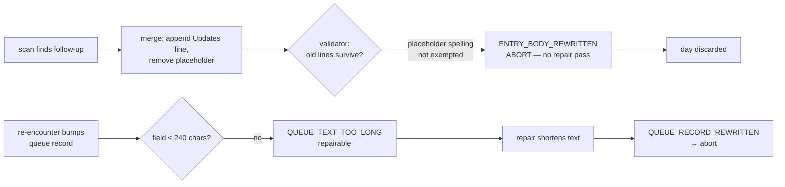

# 2026-08-12 — Validation-abort review: four discarded run days (Aug 1, 2, 5, 7)

## What happened

Four scheduled runs during the pilot extension ended `outcome: validation` and were discarded at the final gate (commit withheld, diagnostics preserved). No corruption reached the library — the guardrails held, as designed — but each failure cost a full day's harvest and left a missing daily report (2026-08-01, -02, -05, -07).

| date | violations | class |
|---|---|---|
| 2026-08-01 | `ENTRY_BODY_REWRITTEN` on `2026-mcp-spec-2026-07-28-revision.md` | ABORT |
| 2026-08-02 | `ENTRY_BODY_REWRITTEN` on the same entry | ABORT |
| 2026-08-05 | `ENTRY_BODY_REWRITTEN` on `2026-google-atlas-gemini-economy-mapping.md`; 2× `QUEUE_TEXT_TOO_LONG` | ABORT |
| 2026-08-07 | 4× `QUEUE_TEXT_TOO_LONG`; after the repair pass, 4× `QUEUE_RECORD_REWRITTEN` | REPAIRABLE → abort |

Aug 1 and 2 failed on the *same* entry because the scan kept encountering MCP-spec follow-ups and re-attempting the same merge; the failure was systematic, not stochastic.

## Root causes — all three were specification defects, not model misbehavior

**1. Validator/template placeholder mismatch (Aug 1, 2, 5).** `engine/templates/entry.md` writes `None yet.` as the empty-Updates placeholder — 96 of 118 live entries contain that exact line. But `check_changed_paths.py` only exempted the spelling `*(none yet)*` (which appears in zero live entries) from its lines-must-survive rule. Any merge disposition that appended a first dated Updates line and removed the `None yet.` placeholder — exactly what `engine/ENGINE.md` P3.2 asks for — read as a body rewrite. `ENTRY_BODY_REWRITTEN` is ABORT-class, so no repair pass ran and the day died.

**2. `schema.md` contradicted the enforced invariant.** The body template instructed that a corrected claim be "marked in place (e.g., '(corrected — see Updates 2026-08-01)')" — but the validator requires everything above `## Updates` to be byte-identical, in unattended *and* manual mode. The instruction was unimplementable and invited exactly this abort class.

**3. Queue grow-only vs. length-bound deadlock (Aug 5, 7).** Deferred-queue free-text fields must only grow (`QUEUE_RECORD_REWRITTEN` fires on any rephrase) but are also capped at 240 characters (`QUEUE_TEXT_TOO_LONG`, MAX_FREE_TEXT). Repeated re-encounter appends pushed `action_needed` fields past the cap; the Aug 7 repair pass then shortened them — the only edit that *looks* like a fix — and converted a repairable violation into a rewrite violation. Once a field neared the cap, every future run carrying a dated append was doomed.

## Fixes applied (2026-08-12, interactive session, user-approved)

1. `scripts/validators/check_changed_paths.py` — `UPDATES_PLACEHOLDERS` now accepts both spellings (`None yet.`, `*(none yet)*`) as removable; new test covers both forms (172 tests green).
2. `engine/schema.md` — mark-in-place instruction removed; corrections live only in the Updates section, and the text above `## Updates` is documented as immutable byte-for-byte.
3. `engine/ENGINE.md` P7 — queue appends share the 240-character per-field budget; when an append cannot fit, bump `last_encountered` only. The bound outranks the append; shortening is never a fix.

## Not changed

- `ENTRY_BODY_REWRITTEN` stays ABORT-class: a genuine body rewrite still voids the run.
- `MAX_FREE_TEXT` stays 240: the queues remain metadata-only by design.
- No workflow (`.github/`) changes; the repair-pass prompt is untouched.

## Residual risks / watch

- Queue fields already near 240 characters can absorb no further context; records that keep re-encountering should be triaged promptly (both queues were cleared 2026-08-12).
- If a future validation abort shows `ENTRY_BODY_REWRITTEN` *without* placeholder removal in the diff, that is a genuine rewrite attempt — a different class; investigate the run transcript, not the validator.
- Diagnostics artifacts do not currently preserve the discarded working tree, so the exact rejected diff must be inferred; worth revisiting if a non-placeholder abort ever occurs.
