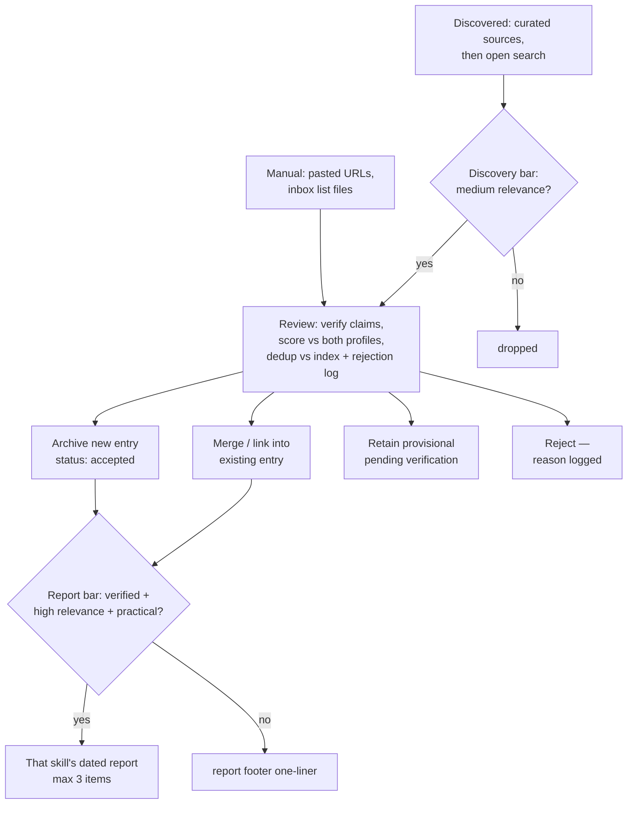
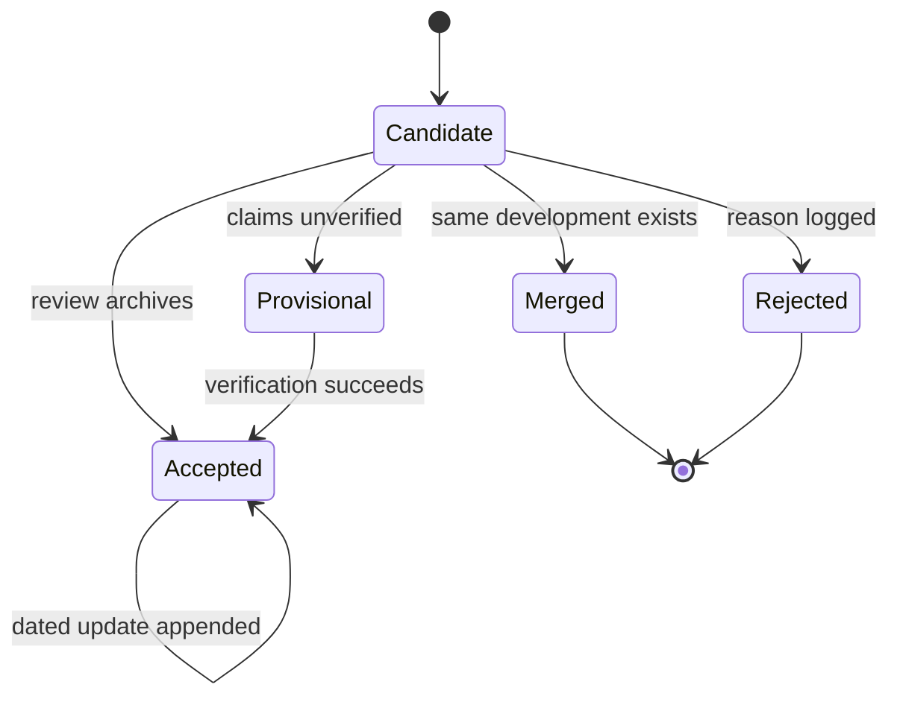

# feat: Build ai_radar v1 — two radar skills on a shared engine

## Summary

Build the ai_radar repository from scratch: a shared markdown engine (schema, pipeline conventions, templates), two user-facing Claude Code skills (`social-science-radar`, `ai-engineering-radar`), a review-gated library, and per-skill daily reports. Script-free v1, built library-first in three phases, with a user review checkpoint closing every unit — the build doubles as a hands-on course in agent-skill design.

Two origin decisions are superseded by user revision at plan time: the combined two-section brief becomes **per-skill daily reports** (audiences differ; avoids two skills editing one file), and ingestion becomes **review-gated** (nothing enters the library without a review disposition; manual saves guarantee review, not acceptance).

---

## Problem Frame

The origin document (see `docs/brainstorms/2026-07-22-ai-radar-requirements.md`) frames the problem: high-quality material on AI-for-social-science and AI engineering is found but not retained; knowledge stays scattered with no accumulating library to build projects on. This plan adds one constraint the brainstorm did not: the user is building their first agent skills and wants to understand every design choice, so the plan must teach as it builds — no black-box generation.

---

## Skill Design Primer

The concepts each implementation unit exercises. Read once here; each unit names which concept it teaches.

**What makes a skill different from a normal prompt.** A prompt is a one-shot instruction consumed by one conversation. A skill is a named, versioned, reusable *procedure* installed into the agent's harness: it carries trigger metadata (so the agent can find it), a defined process (steps, decision rules, output contract), and supporting files. A prompt asks for an outcome; a skill encodes *how the outcome is produced*, so quality is reproducible across sessions and shareable with others.

**The Karpathy method, applied to skills.** Three ideas from Andrej Karpathy's working style transfer directly. (1) *English as a programming language*: write the skill like a program — explicit inputs, steps, outputs, and failure handling, not vibes. Ambiguity in the instruction is a bug. (2) *nanoGPT minimalism*: ship the smallest legible version you fully understand, where every line earns its place; grow it only when a real need appears. (3) *Iterate on observed failures*: treat runs like training steps — run the skill, inspect the output, fix the specific instruction that produced the failure. This project applies all three: script-free minimal v1, manual acceptance tests as the evaluation loop, and `references/`/`scripts/` added only when a failure demands them.

**Anatomy of `SKILL.md`.** YAML frontmatter (`name`, `description`) followed by the body: when to use it, what inputs it expects, the procedure to follow, the output contract, edge-case rules, and pointers to deeper reference files. Frontmatter is the *interface*; the body is the *implementation*.

**Why the description matters.** The description is usually the only part of the skill the agent sees before deciding whether to load it. It must say what the skill does *and when to invoke it*, with concrete trigger phrasing. A weak description causes silent non-invocation (the skill exists but never fires) or over-triggering (it fires on unrelated requests). It is the skill's API signature.

**How the agent decides to invoke a skill.** The harness surfaces every available skill's name and description to the agent each session. The agent matches the user's request against those descriptions; an explicit `/skill-name` always works regardless. Implicit routing quality is therefore entirely a function of description quality — which is why U5 tests both invocation paths.

**What belongs in the main instructions.** The procedure the agent must follow *every* run: steps, decision rules, thresholds, output format, hard constraints. What does not: background reading and rarely-needed detail (put in `references/`), reusable configuration (separate config files — here, `profiles/`), and deterministic computation (later, `scripts/`).

**When to use `references/`, `examples/`, `scripts/`.** Progressive disclosure: keep the always-loaded surface small. `references/` holds depth loaded on demand (in this project, the shared `engine/` directory plays this role for both skills). `examples/` holds gold-standard outputs to imitate — few-shot learning by file (here, sample entries and a sample report). `scripts/` holds deterministic operations where reliability beats judgment — deliberately deferred from v1 so the markdown workflow is understood before automation hides it.

**Sharing conventions without hiding distinct purposes.** The rule that keeps two skills from drifting *or* merging: if editing a piece of text would change both skills' behavior, it belongs in `engine/`; if it defines what one radar cares about or how its audience reads, it belongs in that skill's `SKILL.md` or its `profiles/` files. Each skill keeps its own name, description, selection criteria, and audience voice; neither duplicates pipeline mechanics.

---

## Requirements

R-IDs below are the plan's contract; origin requirements are cited where carried forward. Two origin decisions are superseded (noted).

**Entry lifecycle and library**

- R1. Every candidate — manual or discovered — receives exactly one review disposition: archived as a new entry, merged/linked into an existing entry, retained as provisional pending verification, or rejected with the reason recorded. (Revises origin F1.)
- R2. Manual submissions always enter review regardless of score — saving is a strong relevance signal, not an acceptance guarantee. Discovered items enter review only after clearing the discovery threshold.
- R3. Entries carry a status — `accepted` or `provisional`. Provisional entries are visibly marked, and are never report-eligible until verification upgrades them.
- R4. Rejections are recorded in a dated log with reasons; discovery re-encounters of previously rejected sources are skipped.
- R5. Every entry records provenance: source URL, publisher or author, publication date (or `unknown`, only with page evidence; never inferred silently), and capture date. (Origin R2.)
- R6. Every entry classifies its source: primary source, academic research, or commentary. (Origin R3.)
- R7. Every summarized claim is traceable to its cited source; unverifiable claims are labeled. Independent corroboration is attempted only for load-bearing factual claims. (Origin R4.)
- R8. Re-encountered developments update or link the existing entry via an append-only, dated Updates section — originals are never silently rewritten, so corrections and retractions stay visible. (Origin R5.)
- R9. Every entry and report is written public-safe, shareable as-is. (Origin R6, R21.)

**Ingestion**

- R10. Manual ingestion accepts pasted URLs (singly or batches) and list files dropped in an inbox folder. Batch files are processed line-by-line with per-line status annotations, so interrupted runs resume by skipping annotated lines and one dead URL never aborts a batch. Disposition artifacts (entry, index row, rejection line) are written before the line is annotated, so an interruption between the two causes safe reprocessing caught by dedup rather than a silently skipped item. (Origin R7.)
- R11. The saved-article backlog is seeded through R10. (Origin R8.)
- R12. Candidates are scored against both domain profiles and tagged with every domain that clears; cross-domain items produce one entry, multi-tagged. A cross-domain development may legitimately appear in both skills' reports — the audiences and relevance explanations differ — but always backed by the single shared entry. (Origin AE3.)

**Discovery and scoring**

- R13. A radar run checks the domain's curated sources first, then open web searches derived from the interest profile; the lookback window is the days since that skill's newest report, capped at 7 — and when no report exists yet for that skill, the full 7-day cap. (Origin R9.)
- R14. Each domain's sources file holds the active watchlist plus a proposed-additions section the radar may append to with justification; only the user promotes proposals to active. The radar never queries proposed sources. (Origin R10.)
- R15. Relevance is scored per domain on a qualitative three-tier scale (high / medium / low) against the interest profile, with the rationale recorded on every entry and report item. (Origin R11, R13.)

**Reports**

- R16. Each skill writes its own dated report to `reports/social_science/daily/YYYY-MM-DD.md` or `reports/ai_engineering/daily/YYYY-MM-DD.md`. (Supersedes origin R15's combined brief.)
- R17. The report bar is the highest in the system: accepted status, verified claims, high relevance with a practical implication. At most 3 items per report; when more than 3 qualify, rank by relevance strength then recency and keep the top 3. A footer lists displaced qualifying items and other entries archived that day as one-liners, so nothing disappears silently. (Origin R14, R16 adapted.)
- R18. A run that finds nothing report-worthy writes a report stating no material developments were found — after searching. (Origin R17.)
- R19. A same-day rerun regenerates that skill's report as the union of the day's qualifying items, still capped; existing report items retain their places unless a newly qualifying item strictly outranks them, and displaced items move to the footer.
- R20. Each report is coherent standalone for its audience: economist/social-science colleagues, or an applied AI product team. (Origin R20.)

**Architecture and boundary**

- R21. Two user-facing skills exist as thin domain adapters, each with its own `SKILL.md` (name, description, selection criteria, output instructions). (Origin R18.)
- R22. All shared machinery — pipeline, schema, templates, thresholds — lives in `engine/`; domain differences live only in `profiles/`. (Origin R19.)
- R23. v1 ships no scripts. The dedup index is derived from entries and regenerable by instruction; no state files — a skill's last run date is derived from its newest report file.
- R24. The information boundary follows `CLAUDE.md`'s public-source-first, controlled-internal-access policy (revised at U1): public sources — including material published by the author's organisation — are the default; internal systems are never accessed autonomously; non-public content requires explicit per-use approval and never enters tracked files without confirmation; the five-question information-boundary self-check runs before every write. (Origin R21, AE5, as revised.)
- R25. `CLAUDE.md` states the boundary as a hard operating rule and covers project purpose, the architecture map, directory conventions, and how to run ingestion and radar runs. (Origin R22.)

**Learning workflow**

- R26. Every implementation unit names the skill-design concept it teaches, explains each file's purpose, states how to review the result, includes a manual acceptance test, and ends at a user review checkpoint before the next unit begins.

---

## Key Technical Decisions

- **Skills as thin adapters over a shared engine**: each `SKILL.md` holds only domain identity (description, selection criteria, audience voice, profile pointer) and delegates pipeline mechanics to `engine/` files it references. Prevents drift by construction and demonstrates progressive disclosure — the central skill-design lesson of the project.
- **Four-way review disposition with status-bearing entries**: archive / merge-link / provisional / reject. The library stays curated because nothing is auto-accepted; user misjudgments and weak discoveries are caught at one gate instead of polluting the archive.
- **Three ascending bars**: discovery threshold (medium relevance) to enter review; reviewer judgment to enter the library; report bar (accepted + verified + high relevance + practical implication) to reach the reader. Manual items skip only the first bar.
- **Per-skill dated reports**: eliminates every file-coordination edge case between the two skills (co-authoring, budget splitting, section states) and matches the two distinct audiences. A combined overview is deferred follow-up work.
- **State derived from artifacts, never duplicated**: last-run date = newest report file (quiet days still produce a report, so every run leaves one); dedup = index + entries; the index is derived and regenerable. No state files to drift out of sync — a deliberate harness-engineering lesson.
- **Append-only Updates section per entry**: corrections, retractions, and follow-ups are dated additions; the original claim is marked, never erased. Preserves R7 traceability through an entry's whole life.
- **Dedup by identifier first, similarity second**: canonical URL, DOI/arXiv ID, or repo name matched against the index; then title/topic similarity. Rule of thumb: same underlying artifact or result → update/link; materially new capability or results → new entry linked to the old.
- **Qualitative three-tier scoring**: high/medium/low per domain, no numeric pseudo-precision a script-free agent can't hold consistent. Revisit once a few weeks of rationale data show how the tiers behave.
- **Naming**: `snake_case` for data directories (`social_science`), kebab-case for skill names (`social-science-radar`) per skill-naming convention. Git initialized in the first unit.

---

## High-Level Technical Design

Pipeline — both skills run the identical shape; only the profile differs:



Entry lifecycle:



## Output Structure

```text
ai_radar/
├── CLAUDE.md                     # operating contract: boundary rule, architecture map, conventions
├── README.md                     # public-safe project description
├── engine/
│   ├── ENGINE.md                 # pipeline instructions: intake → review → disposition → report
│   ├── schema.md                 # entry schema, statuses, dedup identifiers, Updates convention
│   └── templates/
│       ├── entry.md              # blank entry with all fields annotated
│       └── daily-report.md       # report layout incl. quiet-day and footer forms
├── profiles/
│   ├── social_science/
│   │   ├── profile.md            # interest profile + relevance lenses (public-safe)
│   │   └── sources.md            # watchlist, outlets, repositories + proposed-additions section
│   └── ai_engineering/
│       ├── profile.md
│       └── sources.md
├── inbox/                        # drop list files here; processed files move to inbox/processed/
├── library/
│   ├── INDEX.md                  # derived dedup index — regenerable from entries
│   ├── rejections.md             # dated rejection log with reasons
│   └── entries/                  # one file per development
├── reports/
│   ├── social_science/daily/
│   └── ai_engineering/daily/
├── docs/
│   ├── brainstorms/
│   └── plans/
└── .claude/skills/
    ├── social-science-radar/SKILL.md
    └── ai-engineering-radar/SKILL.md
```

The tree is a scope declaration; per-unit `Files:` lists are authoritative.

---

## Implementation Units

**Status: all units U1–U8 completed and user-approved on 2026-07-22; v1 shipped and tagged `v1.0.0`.** Each unit ended at a **Checkpoint** — a user review gate. Implementation paused there until the user approved; findings at a checkpoint were fixed before moving on.

### Phase A — Foundation (the library before anything reads or writes it)

### U1. Repository scaffolding and operating contract — ✅ completed (commits 59070c0, c3f31cd, d62d72e)

- **Concept:** what `CLAUDE.md` is and how it differs from a skill — always-loaded project rules vs on-demand procedures. The confidentiality boundary as an enforced operating rule rather than documentation.
- **Requirements:** R24, R25, R9.
- **Dependencies:** none.
- **Files:**
  - `CLAUDE.md` — the operating contract: project purpose (one paragraph); the hard boundary rule (public information only, no client names/project internals/confidential framing, with the pre-write self-check instruction); architecture map (two skills → one engine → one library); directory and naming conventions; how to trigger ingestion and radar runs, written as a clearly-labelled forward-looking section until the skills exist (updated in U5/U6); the workflow convention — commit and push at the end of each approved implementation unit so work is reviewable on GitHub, and never continue past a unit's review checkpoint without user approval.
  - `README.md` — public-safe description of what the project is, for eventual sharing.
  - `.gitignore` — minimal (OS noise).
  - Empty directory skeleton per Output Structure; `git init` and initial commit.
  - Private GitHub repository `ai_radar` under the user's GitHub account: check `gh` authentication first; create local files and the initial commit before creating or pushing the remote; if authentication is unavailable, continue locally and report clearly that the remote was not created.
- **Approach:** write `CLAUDE.md` for the agent as reader, not as documentation prose — imperative rules, short sections. The boundary rule gets its own top section with the self-check wording the engine will reuse.
- **Test scenarios:** Test expectation: none — scaffolding unit; behavior is exercised via the review checkpoint.
- **How to review:** read `CLAUDE.md` asking one question per line: "if the agent obeyed only this line, would it behave correctly?" Vague lines fail.
- **Manual acceptance test:** in a fresh session, ask Claude "what are this project's hard rules?" — the answer must include the public-only boundary and the self-check, unprompted.
- **Checkpoint:** user approves `CLAUDE.md` wording — especially the boundary section — before any content-bearing file exists.

### U2. Archive schema and entry lifecycle — ✅ completed (commits 2e1880d, d2353df)

- **Concept:** designing deterministic conventions an agent can follow reliably — the markdown equivalent of a database schema, and the append-only pattern for auditability.
- **Requirements:** R1, R3–R9, R12.
- **Dependencies:** U1.
- **Files:**
  - `engine/schema.md` — entry frontmatter fields (slug, title, status, domains, source type, source URL, canonical identifiers, publisher/author, published date or `unknown`, captured date, per-domain relevance tier, verification state, selection rationale); body sections (Summary, Why it matters, Verification notes, Updates — append-only and dated, Related entries); the four dispositions and what each writes; dedup matching rules (identifier first, similarity second, same-artifact rule); `INDEX.md` format and its regeneration instruction; `rejections.md` format.
  - `engine/templates/entry.md` — blank annotated template.
  - `library/INDEX.md`, `library/rejections.md` — empty, headers only.
  - Two hand-written sample entries in `library/entries/` (one accepted academic paper, one provisional commentary piece) — these double as the `examples/` teaching device for both skills.
- **Approach:** schema first, samples immediately after — writing two real entries by hand is the fastest way to find schema friction before any skill automates it. Statuses live in frontmatter, not directory structure, so an upgrade from provisional to accepted is an edit, not a move.
- **Test scenarios:**
  - Covers origin AE4. Hand-write the provisional sample from a commentary piece with an unverifiable claim → verification state `unverified`, status `provisional`, rationale notes the limitation.
  - Add a dated update to the accepted sample simulating a correction → original summary text unchanged, Updates section carries the correction with its own capture date.
  - Regenerate `INDEX.md` by instruction from the two entries → index matches entries exactly.
- **How to review:** check every schema field answers "who consumes this downstream?" (dedup, report, or future sharing) — fields with no consumer are cut.
- **Manual acceptance test:** user picks one article they know well; agent drafts an entry; user checks each field for accuracy and each summarized claim against the source.
- **Checkpoint:** user approves the schema and both samples. The schema freezes here for v1 — later friction becomes follow-up work, not silent drift.

### U3. Engine pipeline instructions — ✅ completed (commit 9b54129)

- **Concept:** the shared engine as reference material both skills load on demand — progressive disclosure in practice; encoding thresholds and edge rules so two different skills behave identically.
- **Requirements:** R1, R2, R4, R7, R13, R15, R17–R19, R24.
- **Dependencies:** U2.
- **Files:**
  - `engine/ENGINE.md` — the full pipeline: intake paths (pasted, inbox file, discovered); the three bars (discovery/medium, review judgment, report bar); review steps (verify claims for traceability, corroborate load-bearing claims, score against both profiles, dedup against index and rejection log); the four dispositions with write instructions; a named Verify Provisionals procedure — fires when a new candidate dedup-matches an existing provisional entry, and on explicit user request; success edits status to `accepted`; per-line inbox annotation and resume rule, with disposition artifacts written before the line is annotated; lookback rule (days since newest report, cap 7; first-ever run uses the full cap); report composition (max 3 items ranked by relevance strength then recency, rerun retention rule — existing items keep their places unless strictly outranked, displaced items to the footer — footer one-liners, quiet-day wording); the confidentiality self-check as a named final step before every write.
  - `engine/templates/daily-report.md` — report layout: header, items (title, why-it-matters, source + date + type, entry link, rationale), footer ("also archived today"), quiet-day form.
- **Approach:** write ENGINE.md as numbered procedures the skills invoke by name ("run Intake, then Review, then Disposition") — the skills stay thin because they call procedures rather than restating them.
- **Test scenarios:**
  - Covers origin AE1. Desk-walk a day with zero qualifying items → quiet-day report form, correctly stating a search happened.
  - Covers origin AE2. Desk-walk a re-encounter (archived paper, new outlet, new results) → merge/link disposition, dated update, report-eligible only because the *new* information clears the bar.
  - Desk-walk a below-discovery-bar discovered item → dropped, never reviewed; the same URL pasted manually → reviewed (manual skips only the discovery bar).
  - Desk-walk a rejected-last-week URL re-surfacing in discovery → skipped via rejection log.
  - Desk-walk a provisional entry whose public artifact turns up later → Verify Provisionals fires on the dedup match and upgrades status to accepted.
- **How to review:** the two-readers test — for each procedure, ask whether two different implementers following it would produce the same behavior. Any step where they'd diverge is underspecified.
- **Manual acceptance test:** user picks one real URL; agent executes the pipeline by hand narrating each step and threshold decision; user confirms each decision follows ENGINE.md exactly.
- **Checkpoint:** user approves pipeline semantics — especially the three bars and the four dispositions.

### U4. Domain profiles and source lists (strawman drafts) — ✅ completed (commits beb1897, edf9f7b)

- **Concept:** separating configuration from procedure — the same engine behaves as two different radars purely through config; writing public-safe relevance lenses.
- **Requirements:** R14, R15, R9, R24.
- **Dependencies:** U1, U2.
- **Files:**
  - `profiles/social_science/profile.md` — interest statements and relevance lenses: economic growth, development, digital-technology economics, regulation, empirical/causal methods, AI applied to economics/sociology/political-science/policy research; practical-application bar wording.
  - `profiles/social_science/sources.md` — strawman watchlist (e.g., Acemoglu, Sant'Anna and peers), outlets, repositories (arXiv econ, NBER, SSRN, VoxEU); active list + empty proposed-additions section.
  - `profiles/ai_engineering/profile.md` — lenses: agent architecture, harness engineering, tool use, evaluation/validation, observability, context engineering, deterministic guardrails, security, reproducibility; the generic policy-simulator lens ("agentic simulation of policy interventions") in public-safe wording.
  - `profiles/ai_engineering/sources.md` — strawman labs/engineering blogs, arXiv categories, notable practitioners.
- **Approach:** agent drafts everything from the origin document's vocabulary; every line written to be safe to publish. The user's edit is the quality gate agreed at brainstorm time.
- **Test scenarios:**
  - Covers origin AE5. Draft the policy-simulator lens → contains no client names, project internals, or non-public framing; expresses the interest entirely in generic terms.
  - Score the two U2 sample entries against both profiles → tiers and rationales read as sensible to the user.
- **How to review:** for each profile line ask "would a stranger score articles the way I would, using only this line?" — then edit until yes. Delete watchlist names you wouldn't actually follow.
- **Manual acceptance test:** user names two articles they consider high-relevance and one they consider noise; scoring against the edited profile must rank them accordingly.
- **Checkpoint:** user has edited and approved both profiles and both source lists. **End of Phase A.**

### Phase B — First skill and ingestion (the library becomes usable)

### U5. First skill: social-science-radar (ingestion mode) — ✅ completed (commits e20f73a, 14fa636, ef7afa5)

- **Concept:** the core lesson of the project — `SKILL.md` anatomy, the description as invocation trigger, thin-adapter structure, and both invocation paths (explicit `/name` and implicit routing).
- **Requirements:** R21, R22, R2, R10, R12.
- **Dependencies:** U3, U4.
- **Files:**
  - `.claude/skills/social-science-radar/SKILL.md` — frontmatter: name; description stating what it does and when to trigger (ingesting/reviewing social-science material, running the social-science daily scan — trigger phrases included). Body: scope and audience identity; pointer to its profile and sources files; ingestion procedure (invoke engine Intake → Review → Disposition, citing `engine/ENGINE.md` procedures by name); output instructions (economist-colleague voice); hard rules restated by reference to `CLAUDE.md`, not copied.
  - `CLAUDE.md` — update the forward-looking run-instructions section to match the shipped skill's real name and trigger phrasing.
- **Approach:** build this skill slowly and deliberately as the teaching vehicle — draft the description first and test invocation *before* writing the body, so the description's routing role is observed, not assumed. Daily-scan mode is mentioned but marked "arrives in U8".
- **Execution note:** pause after the frontmatter draft; test invocation with the user before writing the body.
- **Test scenarios:**
  - Explicit invocation `/social-science-radar` with a pasted URL → skill loads, runs ingestion end-to-end, produces a disposition with rationale.
  - Implicit invocation: "save this article about industrial policy for my radar" without naming the skill → skill triggers off the description.
  - Negative trigger: an unrelated request ("help me debug this script") → skill does not fire.
  - Batch: three pasted URLs including one dead link → two dispositions plus one recorded failure; no abort.
- **How to review:** read `SKILL.md` against the thin-adapter rule — any pipeline mechanics restated inline (rather than referenced from the engine) is drift-by-copy and gets moved.
- **Manual acceptance test:** user pastes 3 real saved articles; agent ingests; user checks each disposition, rationale, and resulting entry against the schema.
- **Checkpoint:** user approves the skill's behavior and voice before the sibling skill is built from its shape.

### U6. Second skill: ai-engineering-radar (ingestion mode) — ✅ completed (commits e98290d, 97b1dbc, a2480cf)

- **Concept:** the shared-without-drift rule in practice — what is copied (structure), what is referenced (engine), what is distinct (identity, criteria, voice); cross-domain handling between two live skills.
- **Requirements:** R21, R22, R12.
- **Dependencies:** U5.
- **Files:**
  - `.claude/skills/ai-engineering-radar/SKILL.md` — same anatomy as U5; distinct description (AI-engineering material, data-scientist/AI-builder audience), selection criteria weighted to build-something-with-this practicality, and its own profile pointers.
  - `CLAUDE.md` — complete the run-instructions section now that both skills exist.
- **Approach:** derive from U5's structure deliberately, then diff the two files with the user — the diff *is* the lesson: everything differing is identity, everything identical should be a reference to the engine (and if it isn't, it gets refactored into one).
- **Test scenarios:**
  - Ingest an AI-engineering article → correct domain tag, disposition, rationale.
  - Covers origin AE3. Ingest an agentic-economics framework relevant to both domains → one entry, both domain tags, both profiles' tiers recorded.
  - Trigger separation: a social-science request in a session where both skills exist → only social-science-radar fires.
- **How to review:** review the diff, not the file: any identical non-structural text block in both skills is a drift seed — move it to the engine.
- **Manual acceptance test:** user pastes 2 AI-engineering articles plus 1 known cross-domain item; checks tags, tiers, and that the cross-domain item produced a single multi-tagged entry.
- **Checkpoint:** user approves both skills side by side.

### U7. Backlog seeding through the inbox — ✅ completed (commit 60887c3)

- **Concept:** idempotent, resumable agent workflows — designing for interruption as the default, not the exception; the messy-input reality of real data.
- **Requirements:** R10, R11, R4, R3.
- **Dependencies:** U5, U6.
- **Files:**
  - `inbox/` conventions already defined in ENGINE.md exercised for real; `inbox/processed/` receives completed files.
  - New entries, index rows, and rejection-log lines produced by the seed batch.
- **Approach:** user drops a first list file (10–20 saved URLs, deliberately including LinkedIn links, at least one dead link, and undated posts — the seed corpus is exactly where these cluster). Process line-by-line with annotations; LinkedIn URLs get metadata-only provisional entries with a prompt for the underlying public artifact when one likely exists.
- **Test scenarios:**
  - Full batch → every line annotated `archived <path>` / `merged <path>` / `provisional <path>` / `rejected: <reason>` / `failed: <reason>`; totals reconcile with library changes.
  - Interruption drill: stop the run mid-file, rerun → processing resumes at the first unannotated line; no entry duplicated.
  - LinkedIn URL → provisional metadata-only entry, claims marked unverified, note requesting the public source.
  - Undated blog post → `published: unknown`, capture date as anchor.
- **How to review:** reconcile counts (lines vs dispositions vs new files), then spot-check three entries deeply rather than all shallowly.
- **Manual acceptance test:** the interruption drill above, performed by the user at a moment of their choosing mid-run.
- **Checkpoint:** user reviews the seeded library and confirms the archive is one they'd want to keep growing. **End of Phase B.**

### Phase C — Discovery and daily reports (the radar switches on)

### U8. Web discovery and per-skill daily reports — ✅ completed (commit 07f990b)

- **Concept:** bounded autonomous search driven by config; the report as a filtered view over the library, never a second source of truth.
- **Requirements:** R13–R20.
- **Dependencies:** U5, U6, U7.
- **Files:**
  - Both `SKILL.md` files gain their daily-scan procedure (referencing engine Discovery and Report procedures).
  - `engine/ENGINE.md` Discovery and Report procedures exercised for real; first real files under `reports/social_science/daily/` and `reports/ai_engineering/daily/`.
- **Approach:** discovery queries derive from profile lenses plus watchlist names; curated sources first, open search second; every candidate above the discovery bar flows through the same U3 review. Reports render only what the library accepted — an item report-eligible but absent from the library is a pipeline bug by definition.
- **Test scenarios:**
  - Covers origin AE1. Run a scan on a thin day → quiet-day report written, dated, stating the search happened.
  - Real scan per skill → report has ≤3 items, each with why-it-matters, source + date + type, entry link, rationale; footer lists other same-day archived entries.
  - Same-day rerun → the day's report regenerated as the union of both runs' qualifying items, still capped; no duplicates.
  - Provisional exclusion: force a provisional entry with high relevance into a scan day → appears in footer at most, never as a report item.
  - Watchlist discovery of a genuinely new outlet → lands in the sources file's proposed-additions section with justification, not the active list.
  - Lookback: skip two days, run → search window covers the gap (capped at 7).
- **How to review:** read each report as its intended audience member (economist colleague; AI-team colleague) — does it stand alone, and would you forward it as-is?
- **Manual acceptance test:** run both skills on the same real day; user reads both reports in under five minutes each and traces one item back through entry → source.
- **Checkpoint:** user approves the first real radar day. v1 complete.

---

## Scope Boundaries

### Deferred to Follow-Up Work

- Python/validation tooling (`scripts/`): index rebuild, schema validation, link checking — added only after the markdown workflow is understood and a real failure motivates each script.
- A combined cross-domain overview report on top of the per-skill reports.
- Updating the origin brainstorm document to reflect the two superseded decisions (combined brief → per-skill reports; ingestion → review-gated).

### Deferred for later (carried from origin)

- Scheduling and automation (the daily 2:00 pm run) — after selection quality is proven manually.
- Weekly or monthly synthesis reports.
- A sharing or publishing mechanism — entries and reports stay public-safe from day one so this costs nothing later.
- Additional domains beyond the two radars.

### Outside this product's identity (carried from origin)

- A general AI news aggregator.
- LinkedIn scraping or paywall circumvention — researchers are followed via their public trails.
- Any employer work tooling — no confidential material ever enters this repository.

---

## Risks & Dependencies

- **Web tooling variability**: discovery (U8) depends on web search/fetch availability in the Claude Code runtime; degraded search quality degrades the radar but never corrupts the library — review gates everything.
- **Threshold drift risk**: qualitative tiers depend on profile quality; mitigated by U4's user-edited profiles, per-item rationales (which make miscalibration visible), and the planned tuning pass after a few weeks of reports.
- **Schema friction after freeze**: U2 freezes the schema for v1; friction discovered later becomes follow-up work. Hand-writing sample entries before the freeze is the mitigation.
- **Discipline dependency**: v1 runs only when triggered; the library grows only if the user runs it. Scheduling is the known follow-up once quality is proven.

---

## Sources / Research

- Origin requirements: `docs/brainstorms/2026-07-22-ai-radar-requirements.md` — all product decisions trace there except the two supersessions noted in Requirements.
- Flow and edge-case analysis (this planning session) drove: the three-bar admission design, per-line inbox annotation, append-only Updates, rejection-log dedup, derived last-run state, and the proposed-additions convention.
- Implementation-time reference: the `skill-creator` skill available in the user's environment is the canonical guide for `SKILL.md` conventions; consult it during U5 rather than inventing frontmatter shapes.
