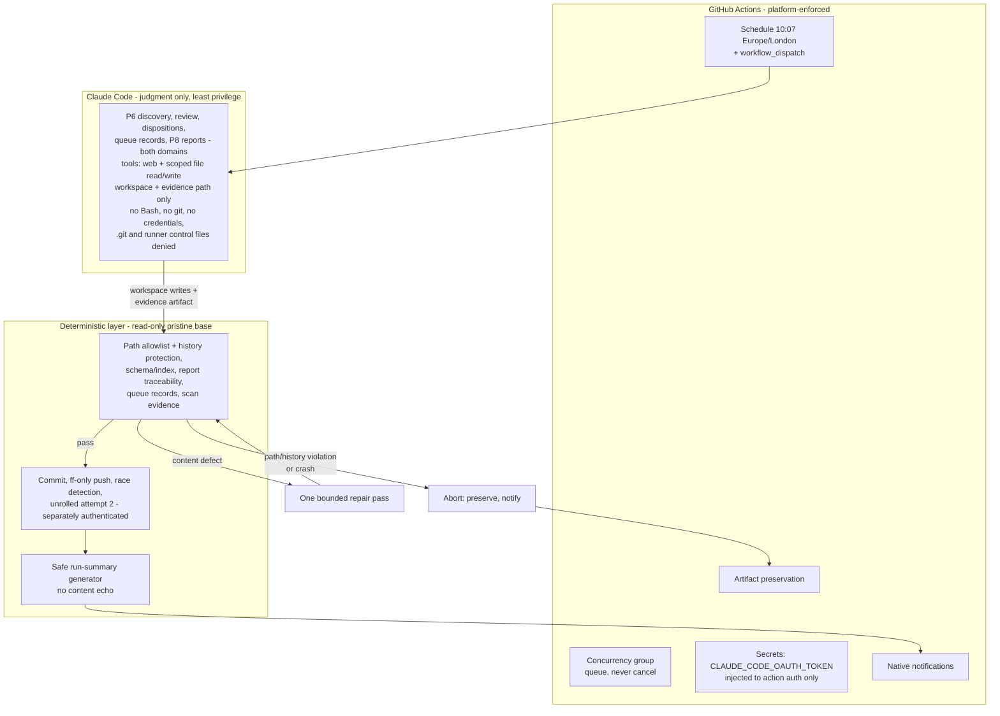
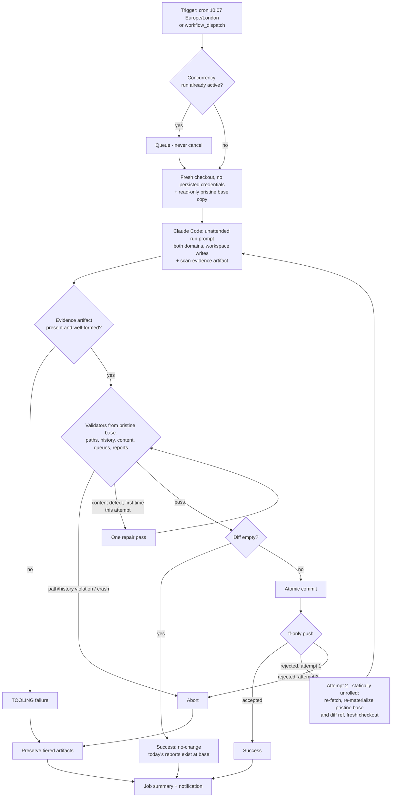
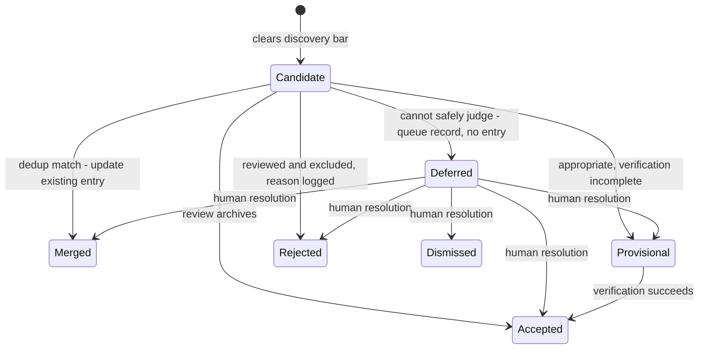
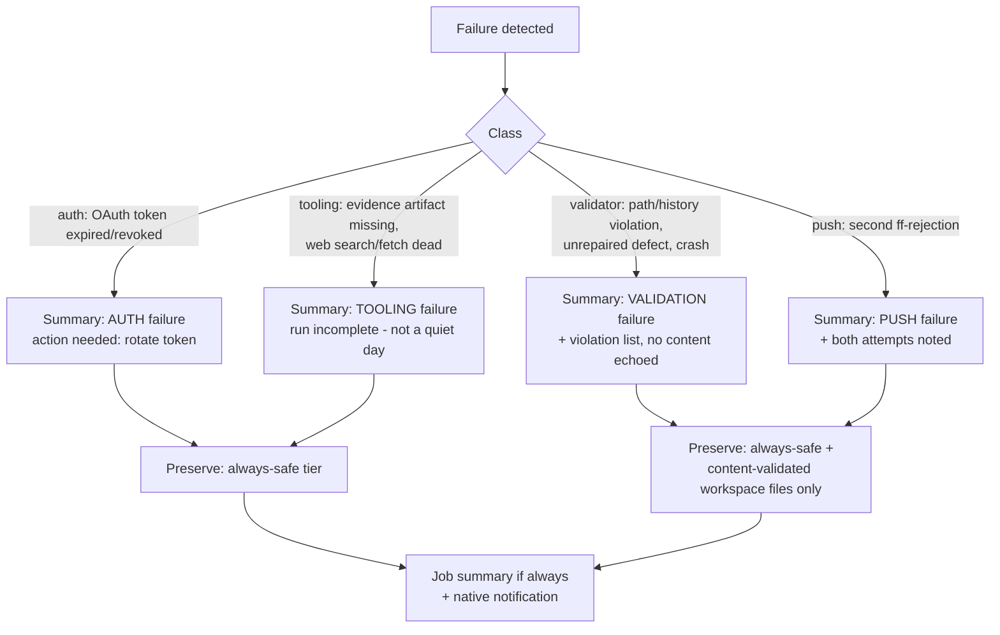

# feat: Unattended daily radar — v2 automation with deterministic guardrails

## Summary

Build v2 of ai_radar: a GitHub Actions workflow runs both radar skills unattended every day at 10:07 am Europe/London, authenticated with `CLAUDE_CODE_OAUTH_TOKEN` (never an API key). Claude Code performs all model-dependent work through the existing engine inside a least-privilege envelope; repository-owned Python validators enforce the autonomous-path allowlist, history protection, and content integrity from a read-only pristine base; the harness owns commit, fast-forward push, a statically unrolled second attempt on push races, artifact preservation, and the job summary. Five phases: feasibility gate → validators → engine amendments → harness → graduated rollout. Like v1, every unit teaches a named engineering concept and ends at a user checkpoint.

---

## Problem Frame

v1 proved selection quality by hand; the library now grows only when the user remembers to trigger runs — the discipline dependency the v1 plan named as its known risk. The origin document (see `docs/brainstorms/2026-07-23-unattended-daily-radar-requirements.md`) resolved the product shape: library-first automation, defer-don't-guess review, per-artifact permissions, and structural rather than instructed enforcement. This plan resolves the how: which scripts, which workflow mechanics, which sequence, and how each guarantee is enforced by a component that cannot drift.

Two research streams ground it. Platform verification confirmed the preferred design is viable: the official Claude Code action accepts `claude_code_oauth_token` with no API key, automation mode runs on `schedule` triggers, and GitHub Actions now supports a native IANA `timezone` key on cron (shipped March 2026) — so the origin's intended YAML works as written. Flow analysis surfaced 21 edge cases; the material ones became plan requirements R39–R46. A five-persona document review then hardened the enforcement design; its corrections are folded in as R47–R50 and revisions to R39, R41, and R43, all user-approved.

---

## Requirements

Origin requirements R1–R38 (and actors A1–A4, flows F1–F5, acceptance examples AE1–AE6) carry forward verbatim as the contract — they are not restated here (see origin: `docs/brainstorms/2026-07-23-unattended-daily-radar-requirements.md`). The traceability matrix below maps every one to implementation units.

**Plan-added requirements (from platform research, flow analysis, and document review; user-confirmed):**

- R39. The model step writes a machine-readable scan-evidence artifact (curated sources fetched and discovery queries executed, per domain) to a runner path outside the repository tree. The harness verifies its presence and structure on every outcome — including no-change — and treats absence or incompleteness as a TOOLING failure; quiet-day reports must additionally contain the evidence block. The harness clears the evidence-artifact path immediately before each model invocation — preserving attempt 1's artifact into diagnostics first — so a stale artifact can never satisfy a later attempt's check. Existence and structure are deterministic checks; the truthfulness of the model-attested activity is an accepted model-judgment risk.
- R40. The discovery lookback window derives from the newest report dated strictly before today (Europe/London), capped at 7 days — so an existing same-day report never collapses the window to zero.
- R41. Enforcement runs from a read-only pristine base: the changed-file diff, the validators, and every other post-model script (delivery, summary) execute from a repository-owned copy materialized from the fetched base commit and made read-only before the model step; workspace copies of scripts are never executed. On a second attempt, the pristine copy and the diff base ref are re-materialized from the new remote head. Every post-model git operation (diff, add, commit, push) runs against a harness-owned git directory with the workspace as work-tree only — workspace `.git` configuration is never consumed.
- R42. Validator semantics: path and history violations always abort the run; content defects permit at most one bounded repair-and-revalidate pass before aborting, and revalidation reruns the complete validator suite — including path and history checks against the full diff — never only the previously failing validators; a validator crash fails closed (abort). Exit-code contract: 0 pass, 1 violation, 2 internal error.
- R43. Failure artifacts are tiered: validator output, counts, changed-path lists, and job summaries always; workspace copies of allowlisted-path files only when they passed content validation — any file named in a content or metadata violation is excluded, with the violation reference standing in; agent transcripts and fetch caches excluded by default (opt-in for supervised debugging only).
- R44. All run-scoped dates — report filenames, `captured` dates, "today" in same-day logic — derive from Europe/London, not runner UTC.
- R45. `workflow_dispatch` is a first-class trigger sharing the schedule path's validators, concurrency group, and same-day union semantics, with inputs for rollout testing (dry-run / no-push / full); whether full mode remains enabled after rollout is decided and recorded at U10.
- R46. The four review-queue files are seeded with format skeletons before the first unattended run, and any pending proposals present in the `sources.md` files at migration time (currently zero) migrate to the new queues as a one-time human-approved migration.
- R47. Validator and harness messages never reproduce flagged content: violation output carries file path, line number, rule identifier, and a fixed redaction indicator only, and a test proves no substring of flagged content reaches validator output, summaries, logs, or notifications.
- R48. The model step runs with a pinned minimal tool surface — web search/fetch and file read/write only; no Bash, no git. The write scope is exactly the workspace tree plus the single harness-designated evidence-artifact path, deny-all otherwise — explicitly denying `.git/` and the runner control files (`$GITHUB_ENV`, `$GITHUB_OUTPUT`, `$GITHUB_PATH`, `$GITHUB_STEP_SUMMARY`). The U1 gate verifies: (a) whether the OAuth token or any other credential is visible or retrievable from the model's tool context — a model-readable credential is a no-go until mitigated; (b) that the action can express this path scoping — a no-go item if it cannot; (c) what egress governance the fetch/search tools support — a domain restriction where available, otherwise the read-plus-fetch exfiltration channel is presented for explicit accepted-risk sign-off, bounded by the repo's public-safe-by-construction content.
- R49. Every model-facing checkout — including the unrolled attempt-2 checkout — uses `persist-credentials: false`; commit and push authenticate only in the separate post-validation delivery context, and a test confirms no usable push credential exists in either attempt's model workspace. Attempt 2's re-fetch and fresh checkout are performed by an authenticated harness step (a second `actions/checkout`), never by bare git commands in the credential-free model workspace.
- R50. History protection, as abort-class validator checks: automated runs never delete any file under `library/` or `reports/`, never modify a report dated before the run date, and may only append to `library/rejections.md`. A modified file under `library/entries/` must preserve its pre-existing body text — changes are confined to permitted frontmatter fields (status, verification, canonical identifiers) and appended content in or after the Updates section. `INDEX.md` remains freely regenerable; resolved queue records are modified only by humans.

---

## Key Technical Decisions

- **Validators are Python 3 stdlib-only, tested with `unittest`.** Frontmatter parsing, table checks, and URL hygiene need real string handling that bash does poorly; zero dependencies means no lockfile, no install step, identical behavior on macOS (manual runs) and ubuntu runners. v2 knowingly ends the script-free era (see origin Key Decisions).
- **Single cron with native `timezone: "Europe/London"`.** Verified against current GitHub docs (March 2026 feature); replaces any dual-cron/DST-gate design. The feature is young, so rollout step 7 verifies actual fire times before the schedule is trusted.
- **Read-only pristine-base enforcement (R41).** The harness materializes a pristine copy of the base commit, marks it read-only before the model step, and executes every post-model script — validators, delivery, summary — from it; the diff is computed against the base ref, and post-model git operations use a harness-owned git directory so workspace `.git` configuration is never consumed. A model-edited workspace copy of any script — or a planted `.git/config` hook — is inert. This closes the self-judging hole flow analysis and document review both flagged.
- **Claude never touches git — enforced by configuration, not instruction.** The model step's tool allowlist excludes Bash and git (R48); its checkout carries no persisted credential (R49); commit, push, race detection, and the second attempt run in a separately authenticated delivery context. The commit-and-push authority requirement (origin R30) is satisfied structurally.
- **Fast-forward push rejection is the authoritative race signal.** The pre-push fetch (origin R25) is an optimization; the push's ff-rejection triggers the second attempt. Removes the TOCTOU window from the correctness argument.
- **The second attempt is statically unrolled, not looped.** GitHub Actions steps execute linearly, exactly once — a script cannot loop back to the marketplace action step. Attempt 2 is a duplicated, conditionally executed sequence (re-fetch → re-materialize pristine base and diff ref → fresh checkout → model → validate → deliver) gated on attempt 1's step outputs. At most two attempts total; each attempt contains at most one conditionally gated repair invocation; job timeout is sized for two full attempts. Attempt 1's dispositions are discarded by design (repo state stays consistent; lost deferrals resurface in later scans); attempt 1's run summary is preserved in diagnostics.
- **Push uses the default `GITHUB_TOKEN` with `permissions: contents: write`, available only to the delivery context.** No PAT, no extra credential. Verified: default-token pushes cannot recursively trigger workflows. Consequence, accepted: the daily commit triggers no other CI.
- **Notification = GitHub native settings + an unconditional summary step.** The job summary step runs `if: always()` so a crashed Claude step still produces a classified summary (auth / tooling / validator / push / no-change), and the user's notification settings deliver every-run notifications during the pilot (origin R34; natively supported per platform verification).
- **An empty diff is a "no-change" success only when proven.** The classification requires the scan-evidence artifact (R39) to validate and both domains' today-dated reports to exist at the base commit; otherwise the run is a TOOLING failure. No `--allow-empty` commits.
- **Resolved queue records behave like rejection-log lines.** A re-encountered candidate or source whose record is in any resolved status is skipped silently — no new record, no update. Only `pending` records receive last-encountered updates (origin R15/R20).
- **Cross-domain deferrals get one record** in the surfacing domain's queue file; the domain field lists both domains; queue dedup checks both files.

---

## High-Level Technical Design

### Trust and enforcement boundaries

Three trust zones. Judgment lives in the model zone; every guarantee lives in a deterministic zone. The model zone holds no credentials and no executable authority.



### Component ownership

| Action | Owner |
|---|---|
| Schedule, dispatch, concurrency, timeout | GitHub Actions |
| Secret storage; injection into action auth only | GitHub Actions secrets |
| Model tool allowlist (no Bash, no git) | Action step configuration (U8) |
| Fresh checkout (`persist-credentials: false`); read-only pristine base materialization | Harness step (script) |
| Discovery, review, dispositions, entries, queues, reports, evidence artifact | Claude Code (skills + engine) |
| Scan-evidence verification; changed-path, history, content validation | Repo validators (from pristine base) |
| Repair-pass decision and bound | Harness step |
| Atomic commit; ff-only push; race detection; unrolled attempt 2 | Harness delivery steps (separately authenticated) |
| Job summary content | Repo script (`make_run_summary.py`, from pristine base) |
| Job summary display; failure artifacts; notifications | GitHub Actions |
| Queue resolution, source promotion, engine/profile edits | User only (A1) |

### Scheduled run — control flow



### Remote-advance second attempt (race with a manual push)

```mermaid
sequenceDiagram
  participant U as User (manual session)
  participant W as Workflow job
  participant O as origin/main
  W->>O: checkout base B0, pristine copy of B0
  W->>W: attempt 1: Claude run + validate + commit C1
  U->>O: push manual commit M1 (base moves to B1)
  W->>O: push C1 (ff-only)
  O-->>W: rejected - not fast-forward
  W->>W: discard workspace and C1
  W->>O: fetch, checkout B1; re-materialize pristine copy and diff ref from B1
  W->>W: attempt 2 (unrolled steps): full rerun from B1 (union rule per engine P8)
  W->>O: push C2 (ff-only)
  alt accepted
    O-->>W: ok - success, summary notes second attempt
  else rejected again
    O-->>W: rejected - abort, preserve artifacts, notify
  end
```

Because attempt 2's pristine base and diff ref come from B1, a legitimate human commit touching protected paths (part of M1) is base state, not a violation. The re-fetch and fresh checkout run in an authenticated harness step (R49); the model workspaces of both attempts never hold credentials.

### Candidate lifecycle (with deferred review)



Re-encounters: `pending` records get last-encountered updates only; any resolved status is skipped silently, like a rejection-log line.

### Failure and preservation paths



Artifact tiers (R43): **always-safe** — validator output (no-echo per R47), counts, changed-path list, both attempts' run summaries; **safe** — workspace copies of allowlisted-path files that passed content validation; any file named in a content or metadata violation is excluded, its violation reference standing in; **excluded by default** — agent transcript, fetched page content, search results.

---

## Path Permission Tables

**Autonomous (allowlisted) paths** — the only paths a scheduled run's diff may touch (origin R22):

| Path | Written by the run as |
|---|---|
| `library/entries/` | new/updated entries |
| `library/INDEX.md` | regenerated index rows |
| `library/rejections.md` | dated rejection lines (append-only) |
| `reports/social_science/daily/` | daily report (create or same-day union; past dates immutable) |
| `reports/ai_engineering/daily/` | daily report (create or same-day union; past dates immutable) |
| `reviews/source_proposals/` | pending proposals, last-encountered updates |
| `reviews/deferred_candidates/` | pending deferral records, last-encountered updates |

**History protection within allowlisted paths (R50):** no deletions under `library/` or `reports/`; reports dated before the run date are immutable; `library/rejections.md` is append-only (existing content must be a byte-prefix of the new content). All abort-class.

**Protected paths** — any automated change aborts the run (origin R23):

| Path | Reason |
|---|---|
| `profiles/` | interest profiles and active watchlists are human-controlled behavior |
| `engine/` | pipeline semantics change only under review |
| `.claude/skills/` | skill identity and triggers |
| `CLAUDE.md`, `README.md`, `CHANGELOG.md`, `docs/` | operating contract and records |
| `.github/`, `scripts/`, `tests/` | the enforcement layer must not modify itself |
| `inbox/`, `internal/`, everything else | out of unattended scope (origin R2; boundary) |

---

## Output Structure

```text
ai_radar/
├── .github/
│   ├── workflows/
│   │   └── radar-daily.yml          # U7/U8 — schedule, dispatch, concurrency, unrolled attempts
│   └── prompts/
│       └── daily-radar.md           # U8 — the unattended run prompt (protected path)
├── scripts/
│   ├── validators/
│   │   ├── lib_radar.py             # U2 — shared frontmatter/paths/dates helpers, no-echo formatter
│   │   ├── check_changed_paths.py   # U3 — allowlist + history protection
│   │   ├── check_clean_base.py      # U3 — manual-run dirty-tree / ff checks
│   │   ├── check_scan_evidence.py   # U4 — evidence artifact presence and structure
│   │   ├── check_library_consistency.py  # U4 — schema fields + INDEX agreement
│   │   ├── check_report_integrity.py     # U4 — report bar (incl. relevance high) + traceability
│   │   └── check_queue_records.py   # U4 — queue format, vocab, metadata-only
│   ├── make_run_summary.py          # U4 — safe job-summary generator
│   └── run_delivery.sh              # U8 — commit, ff-push, attempt gating (executes from pristine base)
├── tests/
│   └── validators/                  # U2–U4 — unittest suites + fixtures/
├── reviews/
│   ├── source_proposals/            # U6 — seeded queue files (2 domains)
│   └── deferred_candidates/         # U6 — seeded queue files (2 domains)
├── docs/ops/
│   ├── 2026-07-XX-v2-feasibility.md # U1 — gate dossier
│   └── v2-rollout-runbook.md        # U9 — graduated rollout + rollback
└── (engine/, profiles/, library/, reports/, .claude/ as today; ENGINE.md amended in U5)
```

The tree is a scope declaration; per-unit `Files:` lists are authoritative.

---

## Implementation Units

Checkpoint discipline carries over from v1: every unit ends at a user review gate; implementation never continues past it without explicit approval.

### Phase 0 — Feasibility and governance gate

### U1. Feasibility dossier and go/no-go

- **Concept:** feasibility gates as first-class engineering artifacts — verifying platform contracts before building on them, and separating "documented", "verified by test", and "organizationally approved".
- **Requirements:** R31, R32, R33, R35, R48 (gate item); plan research findings.
- **Dependencies:** none.
- **Files:** `docs/ops/2026-07-XX-v2-feasibility.md` (dated on completion).
- **Approach:** record the already-gathered documentation findings with sources, then close the gaps that need live verification or user action: (1) user generates the OAuth token via `claude setup-token` and stores it as the `CLAUDE_CODE_OAUTH_TOKEN` repo secret — token value never touches the repo or chat; (2) verify private visibility via `gh repo view --json visibility,isPrivate` and record the output (origin R35); (3) confirm push credential: default `GITHUB_TOKEN` with `contents: write`, and confirm `main` has no branch-protection rule that blocks it; (4) **tool-scope and exposure gate (R48):** determine — from the action's documentation and a sandboxed probe run — (a) whether `CLAUDE_CODE_OAUTH_TOKEN` or any other secret is visible or retrievable from the model's tool-execution context (a model-readable credential is a no-go until a mitigation is verified); (b) whether the action can express the R48 write scope — workspace plus one evidence path, denying `.git/` and the runner control files (a no-go item if it cannot); (c) what egress governance the fetch/search tools support — record a domain-restriction configuration where available, otherwise present the read-plus-fetch exfiltration channel for explicit accepted-risk sign-off; (5) record the unconfirmed items as accepted risks with mitigations — in-workflow token-expiry behavior, subscription rate limits in CI; (6) user confirms employer policy approval for cloud runners + OAuth secret; (7) set an ~11-month token renewal reminder (token is a one-year credential). Document the no-go branch: if any gate item fails, stop and present the cloud-Routine fallback (origin R33) with its weaker agent-invoked enforcement — do not implement it without a separate decision.
- **Test scenarios:** Test expectation: none — verification unit; evidence lands in the dossier (the R48 probe output is part of that evidence).
- **How to review:** every gate item must cite either a source URL, a command output, or an explicit user confirmation — no item may rest on "should work".
- **Manual acceptance test:** user reads the dossier and can answer, for each of origin R31's five verification items plus the R48 exposure question, "confirmed how?" in one sentence.
- **Checkpoint:** explicit go/no-go from the user. Hard stop on no-go.

### Phase 1 — Deterministic contracts and validators

### U2. Validator framework, shared library, and test harness

- **Concept:** deterministic guardrails as a contract — exit codes, fail-closed behavior, no-echo message hygiene, and fixture-based tests that make enforcement auditable; why code beats model judgment wherever the check is mechanical.
- **Requirements:** R30, R42, R44, R47; enables R22–R23, R37, R50.
- **Dependencies:** U1 (go).
- **Files:** `scripts/validators/lib_radar.py`, `tests/validators/` (harness + first fixtures: a minimal valid library snapshot), `scripts/validators/README.md` (the contract).
- **Approach:** Python 3 stdlib only. `lib_radar.py` provides: frontmatter parsing, entry/report/queue file discovery, the allowlist and protected-path sets as data, Europe/London date helpers (R44), and the violation formatter. Contract for every validator: exit 0 pass / 1 violations found / 2 internal error; violations classified `abort` or `repairable`; exit 2 always treated as abort by callers (fail closed). **No-echo rule (R47):** the violation formatter emits file path, line number, rule identifier, and a fixed redaction indicator only — it exposes no API for including flagged content, so no validator can echo it by accident. Tests run with `python3 -m unittest discover tests/`.
- **Patterns to follow:** v1's "English as a programming language" discipline applied to code: each validator's docstring states the requirement it enforces, mirroring how ENGINE.md names procedures.
- **Test scenarios:** frontmatter parser handles v1's real entry format (verify against 2–3 actual `library/entries/` files copied to fixtures); date helper returns London-today across a simulated DST boundary (fixed instants either side of the last-Sunday-in-March/October transitions); violation formatter output is stable and parseable; **no-echo proof (R47): a fixture file containing a distinctive marker string produces violations whose full output — validator stdout and generated summary — contains no substring of the marker**; a deliberately crashing validator exits 2, not 1 or 0.
- **How to review:** read `README.md` as the two-readers test from v1 U3 — would two implementers produce identical validator behavior from the contract alone?
- **Manual acceptance test:** user runs the test suite locally with one command and sees it pass; breaks a fixture on purpose and sees a classified violation that names the file and rule without quoting the content.
- **Checkpoint:** user approves the contract (exit codes, violation classes, fail-closed rule, no-echo rule) before any real validator is built on it.

### U3. Git-boundary and history validators

- **Concept:** enforcing trust boundaries with a pristine reference — the diff and the judge both come from a read-only base, so the checked artifact can't check itself; protecting history, not just paths.
- **Requirements:** R22, R23, R24, R29, R41, R50.
- **Dependencies:** U2.
- **Files:** `scripts/validators/check_changed_paths.py`, `scripts/validators/check_clean_base.py`, tests + fixtures under `tests/validators/`.
- **Approach:**
  - `check_changed_paths.py` — **Inputs:** base ref, workspace dir. **Output:** violation lines for (a) any changed/added/deleted path outside the autonomous allowlist; (b) history-protection breaches (R50): deletion of any existing file under `library/` or `reports/`, modification of a report dated before the run date, a non-append-only change to `library/rejections.md` (existing content must be a byte-prefix of the new content), or a modified entry whose pre-existing body text is not preserved (changes outside permitted frontmatter fields and appended Updates content). **Exit:** 0/1/2; all violations class `abort`. **Enforces:** R22/R23/R50. **Why deterministic:** path comparison, deletion detection, date comparison, and prefix checks must not be judgment calls; this is the single check the whole permission model rests on. Diff computed via git against the base ref (R41); the harness invokes the pristine base copy of this script, never the workspace copy.
  - `check_clean_base.py` — **Inputs:** repo dir. **Output:** dirty-tree file list; whether local ref fast-forwards to `origin/main`. **Exit:** 0/1/2; violations class `abort` (meaning: do not start the run). **Enforces:** R24/R29 for manual sessions — wired into the engine's manual paths in U5. **Why deterministic:** "is the tree clean" and "does this fast-forward" have exact git answers; asking the model wastes judgment on facts.
- **Test scenarios:** fixture repo where the diff touches only `library/entries/` → pass. Touches `profiles/social_science/profile.md` → abort violation naming the path. Adds a new file under `reviews/deferred_candidates/` → pass (Covers AE4 path aspect). Deletes a file under `engine/` → abort. **Deletes an existing `library/entries/` file → abort (R50). Edits a report dated before the run date → abort (R50). Rewrites an existing `library/rejections.md` line → abort; appends a new line → pass (R50). Rewrites an accepted entry's Summary body while keeping frontmatter valid → abort; appends a dated Update and upgrades `status: provisional → accepted` → pass (R50).** Modifies `scripts/validators/check_changed_paths.py` itself → abort (self-protection). Dirty tree with an unrelated edit → clean-base violation listing the file (Covers AE6). Diverged local branch that cannot ff → violation explaining the conflict.
- **How to review:** try to construct a bypass on paper — a path spelling, symlink, rename, new-directory, or history-rewrite case the checks miss — before trusting them.
- **Manual acceptance test:** user deletes an old entry in a scratch branch, runs the validator, and watches it abort naming the deletion — then does the same with a harmless edit to a protected file.
- **Checkpoint:** user approves both validators, the history-protection rules, and the pristine-base invocation rule.

### U4. Content validators and the run-summary generator

- **Concept:** encoding the library's invariants as executable checks — the report bar, index consistency, metadata-only queues, and scan evidence become code that fails closed instead of conventions that erode.
- **Requirements:** R6, R12–R14, R17, R19, R37, R39, R42, R43, R47; origin priority order item 4.
- **Dependencies:** U2; U5 for final queue formats (record layout is set there — build against draft templates, finalize fixtures after U5).
- **Files:** `scripts/validators/check_scan_evidence.py`, `scripts/validators/check_library_consistency.py`, `scripts/validators/check_report_integrity.py`, `scripts/validators/check_queue_records.py`, `scripts/make_run_summary.py`, tests + fixtures.
- **Approach:** per-script contract (all emit violations via the U2 no-echo formatter):
  - `check_scan_evidence.py` — **Inputs:** evidence artifact path (outside the repo tree), run date, domain list. **Output:** violations for a missing artifact, malformed structure, or a domain section absent or lacking both curated-fetch and query entries. **Exit:** 0/1/2; class `abort` (mapped to the TOOLING failure class by the harness). **Enforces:** R39. **Why deterministic:** presence and shape are exact checks; veracity of the attested activity is the documented accepted model-judgment risk.
  - `check_library_consistency.py` — **Inputs:** workspace dir. **Output:** violations where entry frontmatter is missing required schema fields, statuses are outside `accepted|provisional`, or `INDEX.md` rows disagree with entries (missing, extra, stale). **Exit:** 0/1/2; class `repairable` (index is regenerable by design). **Enforces:** schema conformance + origin priority 4. **Why deterministic:** field presence and index agreement are set comparisons.
  - `check_report_integrity.py` — **Inputs:** workspace dir, run date (London). **Output:** violations where a report item lacks a resolvable entry link, links an entry not `accepted` + verified, **links an entry whose relevance tier for the reporting domain is not `high`**, exceeds 3 items, includes a deferred candidate, mismatches the run date, or — on a quiet-day report — lacks the required evidence block. **Exit:** 0/1/2; missing-entry class `abort` (Covers AE5 — a report without its library entry is the defining failure), lesser defects `repairable`. **Enforces:** R6, R17, R39 (report-side). **Why deterministic:** traceability is link resolution and the relevance tier is frontmatter membership, not judgment.
  - `check_queue_records.py` — **Inputs:** workspace dir. **Output:** violations for malformed records, reason classes / statuses outside the controlled vocabularies, URLs carrying query tokens or credentials, oversized free-text fields, or fenced content blocks (the metadata-only heuristics). **Exit:** 0/1/2; class `repairable`. **Enforces:** R12–R14, R19. **Why deterministic:** vocabulary membership and URL hygiene are exact; and a *deterministic* metadata-only check is itself a boundary control — it cannot be talked into leniency.
  - `make_run_summary.py` — **Inputs:** workspace dir, base ref, outcome class, attempt count, validated evidence artifact. **Output:** the R37 job-summary markdown (status; completed vs incomplete; new/updated/provisional counts; deferrals by reason class; rejections; proposals; report item counts; scan-evidence counts; commit hash; report paths; artifact links on failure) — built only from validated artifacts, the validated evidence file, and git metadata, so it cannot leak candidate content by construction; violation references it embeds are already no-echo (R47). **Exit:** 0/2 (a summary generator has no violations). **Enforces:** R37, R39 (summary-side). **Why deterministic:** the safety guarantee is that summary content is derived, never generated.
- **Test scenarios:** index row missing for a new entry → repairable violation; report citing a provisional entry → violation (Covers AE5); **report citing an accepted entry whose relevance for the reporting domain is `medium` → violation (corrupted fixture, R6/report bar)**; report with 4 items → violation; **quiet-day report missing the evidence block → violation (R39)**; **evidence artifact absent or missing one domain → abort (R39)**; queue record with reason class `vibes` → violation; queue URL with `?utm_source=...` → violation; queue record containing a fenced quote block → metadata-only violation (Covers AE1 record-shape aspect); summary generated from a fixture run matches a golden file exactly and contains no substring of any fixture violation content (R47); summary for a quiet-day fixture states both scans ran with evidence counts (Covers AE2).
- **How to review:** for each check ask v1's schema question — "who consumes this downstream?"; every violation class must map to a requirement in the matrix.
- **Manual acceptance test:** user corrupts one fixture per validator and confirms each produces the right class (`abort` vs `repairable`) and a message they could act on without reading code — and without seeing the corrupted content itself.
- **Checkpoint:** user approves the validator catalog as the complete deterministic surface for v2.

### Phase 2 — Engine and lifecycle amendments

### U5. Engine unattended-mode revision

- **Concept:** amending a frozen contract — minimum-diff revision of ENGINE.md that adds an unattended mode without disturbing v1's proven manual semantics; schema freeze respected.
- **Requirements:** R8–R11, R15–R17 (behavioral rules), R18, R20–R21, R24, R29, R39, R40, R44; flow findings on resolved records and cross-domain deferrals.
- **Dependencies:** U1 (go); U3 for the clean-base wiring reference.
- **Files:** `engine/ENGINE.md`, `engine/templates/source-proposal.md`, `engine/templates/deferred-candidate.md`, `engine/schema.md` (expected: no change — see call-out), `.claude/skills/social-science-radar/SKILL.md`, `.claude/skills/ai-engineering-radar/SKILL.md` (unattended-mode pointer only), `CLAUDE.md` (architecture map + run instructions).
- **Approach:** ENGINE.md gains a named **Unattended mode** section (procedures the run prompt invokes by name, keeping the thin-adapter rule): P7-unattended (defer-and-continue; boundary doubt → deferred, never provisional, never entry); the deferred lifecycle and both queue conventions (P6.5 rewritten to point at `reviews/source_proposals/`; deferral procedure writing `reviews/deferred_candidates/`); re-encounter rules (pending → update; resolved → silent skip); cross-domain deferral rule (one record, surfacing domain's file, both domains listed, dedup across both files); lookback redefined as newest report strictly before today, London dates throughout (R40/R44); the scan-evidence artifact schema and the quiet-day evidence block format (R39); degraded-operation semantics and the run-summary fields the harness consumes. **Manual-path wiring (R24/R29):** the Skill contract's manual ingestion and daily-scan procedures now begin by running `scripts/validators/check_clean_base.py` and honoring its abort classes — stop on dirty tree, divergence, or fast-forward failure and leave resolution to the user; the same-day union-base rule is keyed to a passing check. **Schema call-out:** entry statuses stay `accepted | provisional` — the plan expects zero `schema.md` changes; if drafting reveals an unavoidable one, stop and get explicit approval (per origin, the freeze holds unless a requirement forces it).
- **Test scenarios (desk-walks, as v1 U3):** boundary-doubt candidate → deferred record, no entry (Covers AE1); pending proposal re-encountered → single record, updated date; dismissed deferral re-surfaces → no write; manual run on a day with an existing report → clean-base check first, then union base per P8.6, window per R40 (Covers F5, AE6); manual run with a dirty tree → engine instructs stop-and-ask before any pipeline step; cross-domain deferral → one record findable from either domain's review.
- **How to review:** diff-based — the v1 manual path must read unchanged except for the clean-base preamble; every new rule lives in the unattended section or a template. Two-readers test on P7-unattended.
- **Manual acceptance test:** user picks one hostile hypothetical (e.g., a leaked-looking internal slide deck surfacing in discovery) and walks P7-unattended by hand to the exact queue record it would produce.
- **Checkpoint:** user approves the engine revision — especially P7-unattended, the clean-base wiring, and the confirmation that schema.md is untouched.

### U6. Queue scaffolding and proposal migration

- **Concept:** bootstrap and migration as reviewable units — never letting the first unattended write invent a format (flow finding: first-run bootstrap).
- **Requirements:** R12, R18, R46.
- **Dependencies:** U5 (formats are defined there).
- **Files:** `reviews/source_proposals/social_science.md`, `reviews/source_proposals/ai_engineering.md`, `reviews/deferred_candidates/social_science.md`, `reviews/deferred_candidates/ai_engineering.md` (seeded headers + one commented example record each); `profiles/social_science/sources.md`, `profiles/ai_engineering/sources.md` (migration).
- **Approach:** seed all four queue files from the U5 templates. Migrate any pending proposals present in both `sources.md` "Proposed (pending approval)" sections at migration time — currently zero, so the migration step is expected to be a no-op — then reduce each section to a pointer at the queue. Human-approved migration — this touches protected paths, done in an interactive session.
- **Test scenarios:** `check_queue_records.py` passes on all four seeded files; migrated proposal count equals the count removed from both sources files (both expected zero).
- **How to review:** verify no proposal was dropped or reworded in migration; confirm sources.md's active lists are byte-identical.
- **Manual acceptance test:** user opens one seeded queue file and confirms the commented example record matches the U5 template field-for-field.
- **Checkpoint:** user approves the seeded queues and migration. **End of prerequisite work — the harness may now be built.**

### Phase 3 — Scheduled harness

### U7. Workflow skeleton (no model, no push)

- **Concept:** harness-first construction — proving scheduling, concurrency, permissions, credential hygiene, and read-only pristine-base mechanics with a stub before any model or push authority enters the workflow.
- **Requirements:** R1, R25 (checkout discipline), R28, R41, R45, R49.
- **Dependencies:** U2, U3 (validators exist to invoke).
- **Files:** `.github/workflows/radar-daily.yml`, `tests/validators/` additions for any harness-support script.
- **Approach:** workflow with `on.schedule` (`cron: "7 10 * * *"`, `timezone: "Europe/London"`) **left commented out until rollout step 8**, and `workflow_dispatch` with a `mode` input (`dry-run` | `no-push` | `full`); `concurrency: { group: radar-daily, cancel-in-progress: false }`; `permissions: { contents: write }`; job timeout sized for two attempts; steps: checkout with `persist-credentials: false` (R49) → materialize pristine base copy and mark it read-only (R41) → stub "run" (touches a fixture path) → invoke the pristine copy of `check_changed_paths.py` → summary step `if: always()`. No Claude step, no push step yet.
- **Test scenarios:** dispatch `dry-run` → green run, summary rendered; two rapid dispatches → second queues, first never cancelled (Covers R28); stub touching a protected path → validator aborts the job and the summary says why; **tamper drills (R41): stub edits the workspace copies of `check_changed_paths.py` and `run_delivery.sh` → the workflow provably executes the pristine copies and aborts on the tampered diff; write into the pristine copy fails (read-only); stub writes `core.fsmonitor` into the workspace `.git/config` → post-model git operations provably never consume it (harness-owned git directory)**; **credential drill (R49): a step running in the model-workspace context attempts `git push` → fails for lack of a credential**; **control-file drill (R48): a model-workspace-context write to `$GITHUB_ENV` is denied or provably without effect on later steps**; **auth-boundary drill (R32): the workflow file contains no `anthropic_api_key` input, a harness step asserts `ANTHROPIC_API_KEY` is absent and fails closed when it is planted, and the summary reports only a boolean OAuth-secret readiness result**.
- **How to review:** read the YAML asking one question per step: "which component owns this action, and does the ownership table agree?"
- **Manual acceptance test:** user triggers `workflow_dispatch` from the Actions tab, watches the queue-don't-cancel behavior with a double dispatch, and reads the job summary.
- **Checkpoint:** user approves the skeleton; rollout steps 1–3 evidence attaches here.

### U8. Claude invocation and delivery pipeline

- **Concept:** composing a model step inside a deterministic envelope — the model gets a least-privilege workspace and a prompt; everything with authority (validation, commit, push, the second attempt) happens after it, from the pristine base, without it.
- **Requirements:** R2–R7, R25–R27, R30, R32, R34, R36, R37, R39, R41–R43, R48, R49; F1–F3.
- **Dependencies:** U4, U5, U6, U7; U1 secret in place and R48 gate passed.
- **Files:** `.github/workflows/radar-daily.yml` (extend), `.github/prompts/daily-radar.md`, `scripts/run_delivery.sh`, tests for the delivery script's decision logic (attempt gating, repair bound, no-change, abort paths, mockable via env).
- **Approach:** add the `anthropics/claude-code-action` step — `claude_code_oauth_token: ${{ secrets.CLAUDE_CODE_OAUTH_TOKEN }}`, no `anthropic_api_key`, `prompt` pointing at `.github/prompts/daily-radar.md`, **and the R48 tool surface: web search/fetch plus file read/write scoped to the workspace and the designated evidence-artifact path — no Bash, no git, `.git/` and runner control files denied**. The prompt invokes the two skills' daily scans by name per the U5 engine revision, states the allowlist, forbids touching `inbox/`, and requires writing the scan-evidence artifact to the designated runner path outside the repo tree (R39); the harness clears that path before each model invocation, preserving attempt 1's artifact to diagnostics. Then the deterministic tail, every script executed from the read-only pristine base and every git operation using the harness-owned git directory (R41): `check_scan_evidence.py` (absence/malformation → TOOLING failure on every branch) → validators → bounded repair on `repairable`-only failures (one conditionally gated re-invocation of the action with the violation list, then rerun of the **complete** validator suite — never only the failing validators; any `abort` class or second failure → abort) → empty-diff check (no-change success only if today's reports exist at base) → atomic commit and ff-only push from the separately authenticated delivery context (R49). **Attempt 2 is statically unrolled:** a duplicated, `if:`-gated sequence (authenticated harness re-fetch and fresh checkout with `persist-credentials: false` → re-materialize pristine base and diff ref from the new head → model → evidence check → validate → deliver) keyed on attempt 1's push-rejection output; at most two attempts. On abort: tiered artifact upload (`if: failure()`, content-validated files only per R43), classified summary, exit nonzero. Summary step always runs; failure taxonomy (auth/tooling/validation/push/no-change) derived from step outcomes. `mode: dry-run` skips the Claude step (stub), `no-push` stops before push.
- **Execution note:** build the delivery script test-first — its branch logic (repair bound, attempt gating, no-change, abort classes) is exactly where a silent bug becomes an integrity hole.
- **Test scenarios:** delivery-script unit tests: repairable violations at attempt 1 → exactly one repair invocation; abort-class violation → no repair, immediate abort; ff-rejection at attempt 1 → attempt-2 outputs set, once; ff-rejection at attempt 2 → abort (Covers AE3, F2); **attempt-2 base includes a human commit touching `profiles/` → validated against the new base, no violation (R41)**; **attempt 2 with no fresh evidence artifact → TOOLING failure even though attempt 1's artifact existed (R39 stale-reset)**; **the repair invocation introduces a protected-path edit → full-suite revalidation aborts (R42)**; **the attempt-2 workspace passes the credential-absence check (R49)**; empty diff with valid evidence and today's reports at base → no-change success, no commit; **empty diff with missing evidence artifact → TOOLING failure, not no-change (R39)**; simulated auth failure of the model step → summary class AUTH, notification still produced; **artifact upload excludes a file named in a content violation (R43)**. Workflow-level (rollout steps 4–6 provide the live evidence): full run archives entries and pushes one atomic commit (Covers F1); inbox fixture file present → untouched, run passes (flow finding 11); manual push mid-run → second attempt observed (Covers AE3).
- **How to review:** audit the YAML + script against one invariant at a time from origin R25–R27 and R41/R48/R49, and confirm the Claude step's only outputs are workspace files plus the evidence artifact — no step gives it Bash, git, credentials, or write access to the pristine base.
- **Manual acceptance test:** user runs `workflow_dispatch` in `no-push` mode, inspects the would-be commit as an artifact, then a `full` run, and traces one archived entry from job summary → commit → entry → source.
- **Checkpoint:** user approves the complete pipeline before any scheduled activation.

### Phase 4 — Safe rollout

### U9. Graduated rollout, runbook, and drills

- **Concept:** rollout as falsification — each stage exists to disprove one class of failure while the blast radius is still controlled; rollback is written before activation, not during an incident.
- **Requirements:** R1 (activation), R27, R28, R34, R35, R38 (scheduling the review), R43, R45, R47–R50 (drill evidence).
- **Dependencies:** U8.
- **Files:** `docs/ops/v2-rollout-runbook.md`; `.github/workflows/radar-daily.yml` (uncomment schedule at step 8).
- **Approach:** the runbook encodes the nine stages, each with pass evidence recorded inline: (1) local validator suite green (including the no-echo, history-protection, and evidence-artifact tests); (2) local dry-run — user executes the run prompt manually in an interactive session against a scratch branch, validators pass; (3) `workflow_dispatch` dry-run (no model, no push); (4) dispatch `no-push`, then `full` — first real cloud commit; (5) concurrency + remote-advance drills — double dispatch, and a manual push injected mid-run to force the unrolled second attempt; (6) failure drills — a fixture branch with a planted protected-path edit (validator abort + artifacts), a planted deletion of a library file and a rewritten entry body (history-protection aborts), a missing-evidence drill (model stub writes no artifact → TOOLING failure), a revoked-token rehearsal for the AUTH class, and a re-run of the R48 tool-scope and credential-exposure probe against the final assembled workflow — including the repair and attempt-2 branches — so the gate certifies the shipped configuration, not just U1's simpler sandbox; (7) supervised scheduled runs — schedule enabled on a temporary near-time cron for 1–2 fires with the user watching, verifying actual fire time (young timezone feature) and notification delivery to the user's inbox (origin R34 routing); (8) activate the real 10:07 schedule; (9) pilot: two-to-four weeks of every-run notifications, then the R38 review decides success-notification continuation. Runbook also records: GitHub keeps at most one pending run per concurrency group (a second queued dispatch replaces the first — operationally fine, worth knowing); rollback/disable procedures — disable via Actions UI or `gh workflow disable radar-daily.yml`; comment out the schedule block; remove/rotate the secret; each documented with when-to-use.
- **Test scenarios:** Test expectation: none beyond the drills themselves — this unit's deliverable is recorded evidence per stage; the drills cover AE2 (a real quiet day during supervision, if one occurs, else a synthetic thin-window run), AE3, AE4 (first real source proposal), the history-protection and missing-evidence drills, and the notification-delivery check.
- **How to review:** each stage's evidence must name the run URL or command output; no stage marked passed by assertion.
- **Manual acceptance test:** user performs the mid-run manual push drill personally at a moment of their choosing (v1 U7's interruption-drill pattern, promoted to the race path).
- **Checkpoint:** user activates the daily schedule (stage 8) explicitly. v2 enters pilot.

### U10. Pilot review and v2 close

- **Concept:** operating an autonomous system — reading its evidence trail, deciding notification posture from data, and closing the loop on credentials, triggers, and docs.
- **Requirements:** R38, R45 (dispatch decision); definition of done.
- **Dependencies:** U9 + two-to-four weeks of pilot runs.
- **Files:** `docs/ops/v2-rollout-runbook.md` (pilot findings appended), `CHANGELOG.md` (v2 release note), `README.md` (what-works update), decisions recorded for R38 and R45.
- **Approach:** review the pilot window: scheduled-fire reliability, quiet-day honesty (R39 evidence), queue growth and review burden, race/second-attempt occurrences, notification usefulness. Decide failure-only vs every-run notifications (R38) and apply it. **Decide whether `workflow_dispatch`'s `full` mode remains enabled now that the schedule is trusted, or is restricted to `dry-run`/`no-push`; record the operational decision in the runbook (R45).** Confirm the token-renewal reminder exists. Verify the definition of done below and close v2.
- **Test scenarios:** Test expectation: none — review unit.
- **How to review:** the pilot findings must answer: did any day pass silently? (must be no) — and every incomplete run must show its notification.
- **Manual acceptance test:** user picks one pilot day at random and traces report → entry → source, and job summary → commit, both intact.
- **Checkpoint:** user closes v2. Post-v2 work (inbox workflow, synthesis reports) starts from a fresh plan.

---

## Requirement-to-Unit Traceability Matrix

Origin R1–R38 plus plan-added R39–R50. Enforcement column names the deterministic owner where one exists.

| Req | Substance (abbreviated) | Unit(s) | Deterministic owner |
|---|---|---|---|
| R1 | Daily 10:07 Europe/London, both domains | U7, U9 | Actions schedule |
| R2 | Bounded discovery only; no inbox | U5, U8 | prompt + `check_changed_paths` |
| R3 | Run priority order | U5, U8 | prompt order; validators gate 4–6 |
| R4 | Candidate-level degradation | U5, U8 | engine P7-unattended |
| R5 | Quiet-day success definitions | U5, U8 | summary + R39 evidence |
| R6 | Report items from accepted, high-relevance entries only | U4 | `check_report_integrity` |
| R7 | Remote persistence = completion | U8 | `run_delivery.sh` |
| R8 | Defer-and-continue P7 | U5 | engine + prompt |
| R9 | Boundary doubt → deferred, never inclusion | U5 | engine; queue validator shape |
| R10 | Four-state candidate lifecycle | U5 | engine docs |
| R11 | Engine revisions human-reviewed | U5, U6 | checkpoint discipline |
| R12 | Deferred queues at fixed paths | U5, U6 | allowlist + `check_queue_records` |
| R13 | Metadata-only deferred records | U4, U5 | `check_queue_records` |
| R14 | Controlled reason classes/statuses | U4, U5 | `check_queue_records` |
| R15 | Queue dedup; pending-update rule | U5 | engine rules |
| R16 | Human-only resolution; audit order | U5 | engine + protected reviews workflow |
| R17 | Deferred excluded from reports; counts only | U4, U5 | `check_report_integrity`, summary |
| R18 | Proposals queue; P6.5 revision | U5, U6 | allowlist |
| R19 | Proposal record fields | U4, U5 | `check_queue_records` |
| R20 | Proposal dedup/update rules | U5 | engine rules |
| R21 | No autonomous promotion; summary-only mention | U4, U5 | protected `profiles/`; summary |
| R22 | Exact autonomous allowlist | U3 | `check_changed_paths` |
| R23 | Protected paths reject automation | U3 | `check_changed_paths` |
| R24 | Clean-base discipline every run | U3, U5, U7 | `check_clean_base` (engine-wired); fresh checkout |
| R25 | Fresh checkout; validate; fetch; atomic push | U7, U8 | `run_delivery.sh` |
| R26 | Second attempt from new remote state | U8 | unrolled attempt-2 steps |
| R27 | Second race → abort, preserve, notify | U8 | `run_delivery.sh` + Actions artifacts |
| R28 | Queue-don't-cancel concurrency | U7, U9 | Actions `concurrency` (+ runbook note) |
| R29 | Manual-run refusals and union base | U3, U5 | `check_clean_base` wired via engine manual paths |
| R30 | Component division of authority | U7, U8 | workflow structure |
| R31 | Auth feasibility verification | U1 | dossier |
| R32 | OAuth-only auth boundary; fail-closed API-key checks | U1, U7, U8 | workflow lint + harness env assertion |
| R33 | Routine fallback documented, not implemented | U1 | dossier |
| R34 | Every-run notifications (pilot) | U8, U9 | summary `if: always()` + GitHub native |
| R35 | Private visibility verified via GitHub | U1, U9 | `gh repo view` evidence |
| R36 | Boundary policy unchanged; public-safe outputs | U4, U5, U8 | metadata-only validator; artifact tiers; no-echo |
| R37 | Job summary contents | U4, U8 | `make_run_summary.py` |
| R38 | Pilot-end notification decision | U10 | runbook |
| R39 | Machine-readable scan evidence; every-branch check; stale-reset | U4, U5, U8 | `check_scan_evidence.py` + harness gating |
| R40 | Lookback strictly-before-today | U5 | engine rule |
| R41 | Read-only pristine base; harness-owned git dir | U3, U7, U8 | harness base copy + tamper/.git drills |
| R42 | Abort/repairable/fail-closed semantics | U2, U8 | exit-code contract; `run_delivery.sh` |
| R43 | Tiered artifacts; violating files excluded | U8 | upload steps |
| R44 | Europe/London dates everywhere | U2, U5 | `lib_radar.py` helpers; engine rule |
| R45 | First-class dispatch; post-rollout mode decision | U7, U8, U9, U10 | workflow inputs; runbook |
| R46 | Queue seeding + conditional proposal migration | U6 | seeded files |
| R47 | No-echo violation output, proven by test | U2, U4 | violation formatter + no-echo tests |
| R48 | Scoped tool surface (write scope, `.git`/control-file denial, egress gate) | U1, U7, U8, U9 | action tool config; U1 probe + U9 re-probe |
| R49 | No git credentials in any model workspace; authenticated attempt-2 checkout | U7, U8, U9 | `persist-credentials: false`; credential drills both attempts |
| R50 | History protection (no delete; past reports immutable; append-only log; entry bodies preserved) | U3 | `check_changed_paths` |

---

## Risks and Mitigations

| Risk | Mitigation |
|---|---|
| Subscription rate limits / usage behavior in CI unconfirmed | U1 records as accepted risk; supervised runs (U9 stage 7) observe real usage before daily activation; run is once-daily and bounded |
| OAuth token expires (~1 year) or is revoked mid-pilot | AUTH failure class is distinct and loud in summary/notification; renewal reminder set in U1 |
| OAuth token readable from the model's tool context (unverified) | R48 gate item in U1: sandboxed probe; model-readable credential = no-go until mitigated |
| Prompt injection via fetched web content | Layered containment: scoped tools with `.git` and control files denied (R48), no credentials in any model workspace (R49), read-only pristine base + harness-owned git dir (R41), allowlist + history validators (R22/R50), no-echo messages (R47), egress governed per the U1 gate; semantic content injection remains model-judgment — see below |
| `timezone` schedule feature is young (community reports of misfires) | U9 stage 7 verifies actual fire times; fallback dual-cron pattern documented in the runbook, not built |
| Scheduled fires delayed or dropped by platform | 10:07 avoids peak; lookback (R40) self-heals gaps; a missing daily notification is itself the detection signal, documented in the runbook |
| Model writes outside the allowlist, deletes history, or edits scripts | `check_changed_paths` from the read-only pristine base aborts (R41/R50); tamper and deletion drills in U7/U9 |
| Degraded web tooling produces false quiet days | R39: evidence artifact presence/structure deterministically checked on every branch, incl. no-change; veracity of attested activity is an accepted, documented model-judgment residual |
| Second-attempt nondeterminism (attempt 2 ≠ attempt 1) | By design: repo consistency guaranteed, attempt-1 summary preserved in diagnostics; deferrals lost to attempt discard resurface in later scans |
| Repair pass loops or overreaches | Hard bound: one conditionally gated pass per attempt, `repairable` classes only, revalidate, else abort |
| Transcript/diagnostic leakage of boundary-sensitive content | R43 tiers with violation-named files excluded; R47 no-echo messages; summary derived-only by construction |
| Branch protection or token permissions block the push | U1 verifies push credential and branch rules before anything is built |
| Semantic prompt injection shaping newly written entry/report content | Irreducible model-judgment surface, accepted: entry-body preservation (R50) protects the existing record; review gates (human reads reports daily) and full git traceability bound the rest; no deterministic fix exists for newly written content |

---

## Scope Boundaries

### Deferred to Follow-Up Work

- The separate triggered inbox/backlog workflow (origin scope: explicitly out of the daily run).
- A push/PR-triggered CI workflow running the validators on *human* commits (natural extension once validators exist; default-token pushes from the radar won't trigger it).
- Failure-only notification switch — decided at U10 per R38, implemented then if chosen.
- Validator extensions with no current failure motivating them (link checking, full schema linting of v1 back-catalog).
- The cloud-Routine fallback — implemented only if U1 returns no-go, under its own decision.

### Deferred for later (carried from origin)

- Weekly/monthly synthesis, combined cross-domain overview report, additional domains, sharing/publishing mechanism, discovery-quality tuning from accumulated rationale data.

### Outside this product's identity (carried from origin)

- Any Anthropic API key or custom LLM API client; autonomous edits to `profiles/`, `engine/`, `CLAUDE.md`, skills, or workflow config; autonomous promotion/resolution of queue items; force-pushes or autonomous merge/rebase/conflict resolution; general AI news aggregation, LinkedIn scraping, paywall circumvention.

---

## Open Questions (deferred to implementation)

- Whether the claude-code-action `prompt` input accepts a repo file path or the workflow inlines/shell-reads `.github/prompts/daily-radar.md` — U8 mechanics.
- How the harness-owned git directory is realized — a `--git-dir`/`--work-tree` split over the existing checkout, or a fresh harness-side clone for diff/commit — U8 mechanics.
- Exact job-summary rendering (layout, status conventions) — U4/U8 finalize against `GITHUB_STEP_SUMMARY` limits (1 MiB/step).
- Whether attempt-1 workspace files (beyond its run summary and evidence artifact) are worth preserving on successful second attempts — decide from U9 drill experience.

---

## Definition of Done (v2)

1. U1 dossier complete; go recorded; secret installed; private visibility evidence captured (R35); all three R48 gate items resolved — credential exposure, write-scope expressibility, egress governance — with any exposure mitigation verified.
2. Validator suite green locally and in CI context; no-echo proof (R47), history-protection tests including entry-body preservation (R50), tamper drills for validators, the delivery script, `.git/config`, and runner control files (R41/R48), and the credential-absence drills for both attempts' workspaces (R49) all pass.
3. Engine unattended mode merged with schema.md untouched (or an approved exception); manual clean-base wiring in place (R24/R29); queues seeded; conditional migration done (R46).
4. All nine rollout stages show recorded evidence, including the race drill, the history-protection and missing-evidence failure drills with tiered artifacts, the R48 re-probe against the final assembled workflow, and verified notification delivery.
5. Daily schedule active; ≥5 consecutive scheduled runs with zero silent days — every calendar day in the window shows either a successful run (including no-change and honest quiet days) or a failure notification.
6. Pilot review held (2–4 weeks); R38 and R45 decisions recorded and applied; token-renewal reminder confirmed.
7. Traceability matrix audited: every origin R1–R38 and plan R39–R50 verifiably enforced or documented as accepted risk.
8. `CHANGELOG.md` and `README.md` updated; v2 tagged.

---

## Sources / Research

- Origin requirements: `docs/brainstorms/2026-07-23-unattended-daily-radar-requirements.md` — all product decisions trace there; plan-added R39–R46 were user-confirmed at planning time; R47–R50 and the R39/R41/R43 revisions came from the five-persona document review, user-approved.
- Platform verification (2026-07-23, official docs): `claude_code_oauth_token` input in `anthropics/claude-code-action` `action.yml`; scheduled automation-mode example in code.claude.com/docs/en/github-actions; one-year token via `claude setup-token` (code.claude.com/docs/en/authentication); native `on.schedule` `timezone` key (docs.github.com workflow-syntax; GitHub changelog "Late March 2026"); concurrency pending-run semantics (docs.github.com control-workflow-concurrency); `GITHUB_STEP_SUMMARY` 1 MiB/step; notification routing for scheduled workflows (creator/last-modifier); `actions/upload-artifact@v7`; default-token pushes trigger no workflows (docs.github.com github_token). Unconfirmed and carried as risk: in-workflow token-expiry behavior, CI rate-limit specifics, private-repo max artifact retention, model-context credential visibility (U1 probe).
- Flow analysis (this planning session): 21 findings; material ones became R39–R46 and unit content (pristine-base validation, repair taxonomy, discovery-window fix, false-quiet-day guard, bootstrap/migration, dispatch, empty-diff, London dates, resolved-record and cross-domain rules). Findings assuming UTC-only cron were superseded by the timezone verification.
- Document review (this planning session, five personas, two rounds): round 1 produced the no-echo rule, the deterministic scan-evidence mechanism, the statically unrolled second attempt, the minimal tool surface and credential-exposure gate, the read-only pristine base extension to all post-model scripts, the `persist-credentials: false` requirement, history protection, attempt-2 base re-materialization, the relevance-high report check, and the manual clean-base wiring. Round 2 verified all round-1 fixes landed and added: the exact R48 write scope (workspace + evidence path, `.git` and runner control files denied), egress governance as a gate item, the harness-owned git directory, attempt-2 checkout credential hygiene, evidence-path stale-reset, the final-workflow re-probe, entry-body preservation, and full-suite post-repair revalidation.
- v1 artifacts to mirror: `docs/plans/2026-07-22-001-feat-ai-radar-v1-plan.md` (unit anatomy, checkpoint discipline, learning frame); `engine/ENGINE.md` P6–P8 (lines 67–90); `engine/schema.md` statuses (line 15); current proposals sections at `profiles/social_science/sources.md:39` and `profiles/ai_engineering/sources.md:33`.
