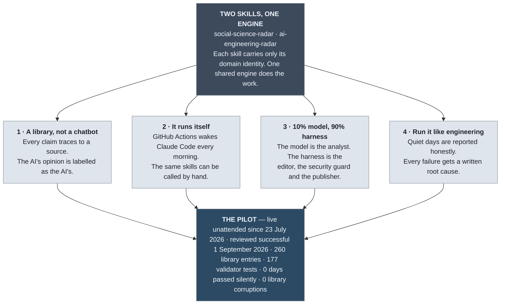

# Presentation v1 — the radar in four ideas

One screen for a short talk. The diagram is the story; the table underneath holds the links to open live, top to bottom, ending with the pilot.

## What to open on screen

| # | idea | say | open |
|---|---|---|---|
| 0 | Two skills, one engine | **social-science-radar** watches credible work on generative and agentic AI applied to economics, development, digital policy, regulation, political science and empirical methods. **ai-engineering-radar** watches technical practice for building reliable AI products: agent architecture, harness and context engineering, tool use, evaluation, guardrails, observability, security. Each skill is a thin file that says what its radar cares about and who it writes for. Everything else, from intake to the daily report, is one shared engine, so the two cannot drift apart. Either skill runs by hand from Claude Code with a pasted link or "run the scan", and unattended every morning. | [social-science-radar](../../.claude/skills/social-science-radar/SKILL.md) · [ai-engineering-radar](../../.claude/skills/ai-engineering-radar/SKILL.md) · [the engine](../../engine/ENGINE.md) |
| 1 | A library, not a chatbot | Two agents scan public sources daily and archive what clears the bar as structured, citable entries. Frontmatter carries provenance, relevance per domain, verification state and the selection rationale. The "Why it matters" section is marked as the radar's own view. | [one entry](../../library/entries/2026-acemoglu-knowledge-collapse.md) · [the index](../../library/INDEX.md) |
| 2 | It runs itself | Five steps. Actions fires on a schedule. It checks out a pristine copy. Claude Code runs with no shell, no git and a fixed list of websites. Validators diff what it wrote. Only then the harness commits. The same skills answer by hand in Claude Code when I paste a link. | [one commit per day](https://github.com/harryaquijeballon/ai_radar/commits/main) · [the workflow](../../.github/workflows/radar-daily.yml) |
| 3 | 10% model, 90% harness | The 10% is one prompt file. The 90% is the egress allowlist, the validators, the human review queues and the tests. Spend the engineering effort on the 90%. | [the prompt](../../.github/prompts/daily-radar.md) · [the validators](../../scripts/validators/README.md) · [the allowlist](../../profiles/egress_allowlist.md) |
| 4 | Run it like engineering | Requirement-first build with acceptance criteria and staged gates. Every incident has a dated write-up. A day with nothing material says so, with the scan evidence listed. | [ops notes](../ops/) · [one incident](../ops/2026-08-12-validation-abort-review.md) · [a quiet day](../../reports/social_science/daily/2026-09-08.md) |
| — | The pilot | Six weeks unattended. Failures were loud, root-caused and fixed. The library never moved on a bad day. | [pilot evaluation](../ops/2026-09-01-pilot-evaluation.md) |

## Key message

Agentic AI does real research monitoring unattended when you split the job. The model judges, the harness enforces, a human resolves doubt. The interesting engineering is in the harness, and the harness is reusable: a new domain is a profile file and a thin skill, not new code.
